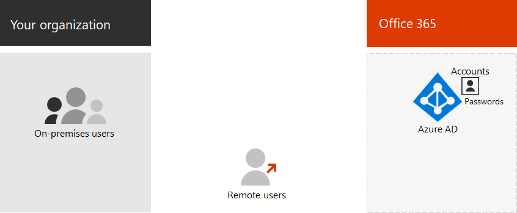
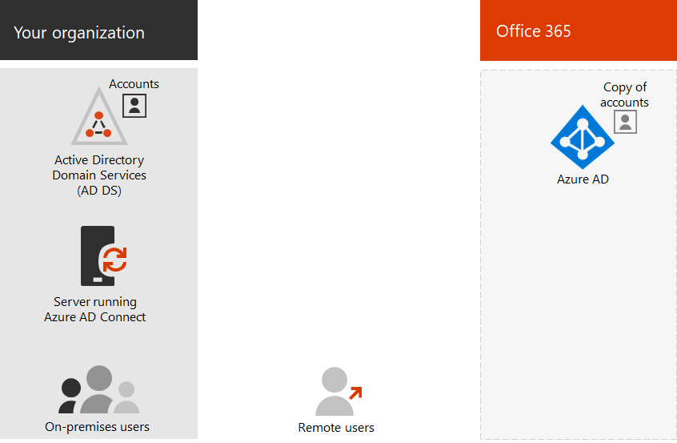

# Office 365 identity models and Azure Active Directory

*This article applies to both Office 365 Enterprise and Microsoft 365 Enterprise.*

Office 365 uses Azure Active Directory (Azure AD), a cloud-based user identity and authentication service that is included with your Office 365 subscription, to manage identities and authentication for Office 365. Getting your identity infrastructure configured correctly is vital to managing Office 365 user access and permissions for your organization.

Before you begin, watch this video for an overview of identity models and authentication for both Office 365 and Microsoft 365.

> [!VIDEO https://www.microsoft.com/videoplayer/embed/RE2Pjwu]

Your first planning choice is the Office 365 identity model.

## Office 365 identity models

To plan for user accounts, you first need to understand the two identity models in Microsoft 365. You can maintain your organization's identities only in the cloud, or you can maintain your on-premises Active Directory Domain Services (AD DS) identities and use them for authentication when users access Microsoft 365 cloud services.  

Here are the two types of identity and their best fit and benefits.

|||
|:-------|:-----|:-----|
|  | **Cloud-only identity** | **Hybrid identity** |
| **Definition** | User account only exists in the Azure Active Directory (Azure AD) tenant for your Microsoft 365 subscription. | User account exists in AD DS and a copy is also in the Azure AD tenant for your Microsoft 365 subscription. The user account in Azure AD might also include a hashed version of the user account password. |
| **How Microsoft 365 authenticates user credentials** | The Azure AD tenant for your Microsoft 365 subscription performs the authentication with the cloud identity account. | The Azure AD tenant for your Microsoft 365 subscription either handles the authentication process or redirects the user to another identity provider. |
| **Best for** | Organizations that do not have or need an on-premises AD DS. | Organizations using AD DS or another identity provider. |
| **Greatest benefit** | Simple to use. No extra directory tools or servers required. | Users can use the same credentials when accessing on-premises or cloud-based resources. |
||||

## Cloud-only identity

A cloud-only identity uses user accounts that exist only in Azure AD. Cloud identity is typically used by small organizations that do not have on-premises servers or do not use AD DS to manage local identities. 

Here are the basic components of cloud-only identity.
 

Both on-premises and remote (online) users use their Azure AD user accounts and passwords to access Office 365 cloud services. Azure AD authenticates user credentials based on its stored user accounts and passwords.

### Administration
Because user accounts are only stored in Azure AD, you manage cloud identities with tools such as the [Microsoft 365 admin center](https://admin.microsoft.com) and Windows PowerShell with the Azure Active Directory PowerShell for Graph module. 

## Hybrid identity

Hybrid identity uses accounts that originate in an on-premises AD DS and have a copy in the Azure AD tenant of a Microsoft 365 subscription. However, most changes only flow one way. Changes that you make to AD DS user accounts are synchronized to their copy in Azure AD. But changes made to cloud-based accounts in Azure AD, such as new user accounts, are not synchronized with AD DS.

Azure AD Connect provides the ongoing account synchronization. It runs on an on-premises server, checks for changes in the AD DS, and forwards those changes to Azure AD. Azure AD Connect provides the ability to filter which accounts are synchronized and whether to synchronize a hashed version of user passwords, known as password hash synchronization (PHS).

When you implement hybrid identity, your on-premises AD DS is the authoritative source for account information. This means that you perform administration tasks mostly on-premises, which are then synchronized to Azure AD. 

Here are the components of hybrid identity.

The Azure AD tenant has a copy of the AD DS accounts. In this configuration, both on-premises and remote users accessing Microsoft 365 cloud services authenticate against Azure AD.

>[!Note]
>You always need to use Azure AD Connect to synchronize user accounts for hybrid identity. You need the synchronized user accounts in Azure AD to perform license assignment and group management, configure permissions, and other administrative tasks that involve user accounts.
>

### Administration

Because the original and authoritative user accounts are stored in the on-premises AD DS, you manage your identities with the same tools as AD DS, such as the Active Directory Users and Computers tool. 

You don’t use the Microsoft 365 admin center or Windows PowerShell to manage synchronized user accounts in Azure AD.

## Next step

If you need the cloud-only identity model, see [Cloud-only identities](cloud-only-identities.md).

If you need the hybrid identity model, see [directory synchronization](plan-for-directory-synchronization.md).
  

## Video training

See the video course [Office 365: Manage Identities Using Azure AD Connect](https://support.office.com/article/90991a1d-c0ab-479a-b413-35c9706f6fed.aspx), brought to you by LinkedIn Learning.

## See also

[Microsoft 365 Enterprise overview](https://docs.microsoft.com/microsoft-365/enterprise/microsoft-365-overview)
