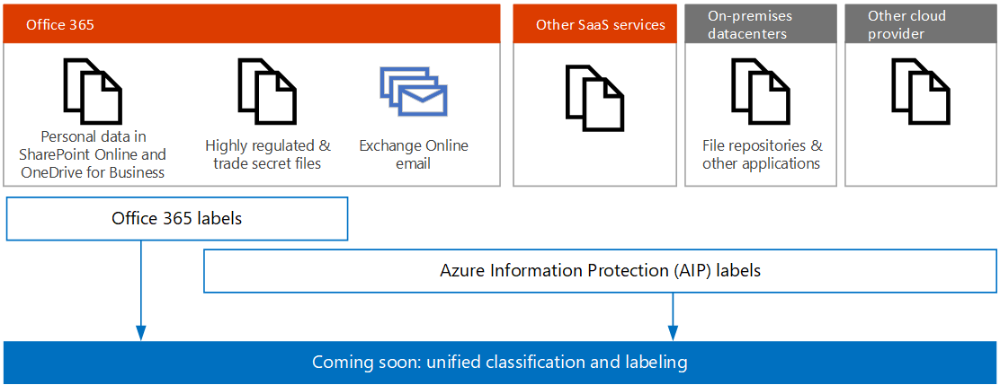
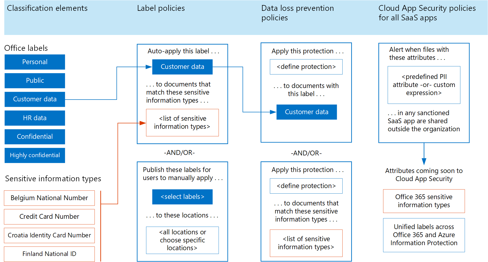

# Apply labels to personal data in Office 365

 Use this topic if you are using Office labels as part of your GDPR protection plan. Today labels can be created in the Office 365 Security & Compliance Center and in Azure Information Protection. Over time these technologies will converge into a unified labeling and classification engine and you will be able to achieve even more.

If you are using labels for protection of personal data in Office 365, Microsoft recommends you start with Office labels. You can use Advanced Data Governance to automatically apply labels based on sensitive information types or other criteria. You can use Office labels with data loss prevention to apply protection. You can also use labels with eDiscovery and Content Search. You’ll soon be able to use both labels and sensitive information types with Cloud App Security to monitor personal data that resides in other SaaS apps.

Azure Information Protection labels are currently recommended for applying labels to files on premises and in other cloud services and providers. These are also recommended for files in Office 365 that require Azure Rights Management (Azure RMS) encryption for data protection, such as trade secret files.

At this time, using Azure Information Protection to apply Azure RMS encryption is not recommended for files in Office 365 with data that is subject to the GDPR. Office 365 services currently cannot read into RMS-encrypted files. Therefore, the service can’t find sensitive data in these files.

Azure Information Protection labels can be applied to mail in Exchange Online and these labels work with Office 365 data loss prevention. Coming soon with the unified classification and labeling engine you will be able to use the same labels for email and files, including automatically labeling and protecting email in transit.

In the illustration:

-   Use Office 365 labels for personal data and for highly regulated & trade secret files in SharePoint Online and OneDrive for Business.

-   Use Azure Information Protection (AIP) labels for highly regulated & trade secret files, Exchange Online email, files in other SaaS services, files in on-premises datacenters, and files in other cloud providers.

-   Coming soon: both types of labels will converge into a unified classification and labeling engine.

Use Office labels and sensitive information types across Microsoft 365 for information protection
=================================================================================================

The following illustration shows how Office labels and Sensitive information types can be used in label policies, data loss prevention policies, and with Cloud App Security policies.

For accessibility, the following table provides the same examples in the illustration.

<table>
<thead>
<tr class="header">
<th align="left"><strong>Classification elements</strong></th>
<th align="left"><strong>Label policies — 2 examples</strong></th>
<th align="left"><strong>Data loss prevention policies — 2 examples</strong></th>
<th align="left"><strong>Cloud App Security policies for all SaaS apps — 1 example</strong></th>
</tr>
</thead>
<tbody>
<tr class="odd">
<td align="left">Office labels. Examples: Personal, Public, Customer data, HR data, Confidential, Highly confidential</td>
<td align="left">
Auto apply this label . . .

Customer data

. . . to documents that match these sensitive information types . . .

&lt;list of example sensitive information types&gt;
</td>
<td align="left">
Apply this protection . . .

&lt;define protection&gt;

. . . to documents with this label . . .

Customer data
</td>
<td align="left">
Alert when files with these attributes . . .

&lt;predefined PII attribute -or- custom expression&gt;

. . . in any sanctioned SaaS app are shared outside the organization
</td>
</tr>
<tr class="even">
<td align="left">Sensitive information types. Examples: Belgium National Number, Credit Card Number, Croatia Identity Cart Number, Finland National ID</td>
<td align="left">
Publish these labels for users to manually apply . . .

&lt;select labels&gt;

. . . to these locations . . .

&lt;all locations or choose specific locations&gt;
</td>
<td align="left">
Apply this protection . . .

&lt;define protection&gt;

. . . to documents that match these sensitive information types&gt;
</td>
<td align="left">Note: Attributes coming soon to Cloud App Security include Office 365 sensitive information types and Unified labels across Office 365 and Azure Information Protection.</td>
</tr>
</tbody>
</table>

Prioritize auto-apply label policies
====================================

For personal data that is subject to GDPR, Microsoft recommends auto-applying labels by using the sensitive information types you curated for your environment. It is important that auto-apply label policies are well designed and tested to ensure the intended behavior occurs.

The order that auto-apply policies are created and whether users are also applying these labels affect the result. So, it is important to carefully plan the roll-out. Here’s what you need to know.

### One label at a time

You can only assign one label to a document.

### Older auto-apply policies win

If there are multiple rules that assign an auto-apply label and content meets the conditions of multiple rules, the label for the oldest rule is assigned. For this reason, it is important to plan the label policies carefully before configuring them. If an organization requires a change to the priority of the label policies, they will need to delete and recreate them.

### Manual user-applied labels trump auto-applied labels

Manual user applied labels trump auto-applied labels. Auto-apply policies cannot replace a label that is already applied by a user. Users can replace labels that are auto-applied.

### Auto-assigned labels can be updated

Auto-assigned labels can be updated by either newer label policies or by updates to existing policies.

Be sure your plan for implementing labels includes:

-   Prioritizing the order that auto-apply policies are created.

-   Allowing enough time for labels to be automatically applied before rolling these out for users to manually apply. It can take up to seven days for the labels to be applied to all content that matches the conditions.

### Example priority for creating the auto-apply policies

<table>
<thead>
<tr class="header">
<th align="left"><strong>Labels</strong></th>
<th align="left"><strong>Priority order to create auto-apply policies</strong></th>
</tr>
</thead>
<tbody>
<tr class="odd">
<td align="left">Human Resources — Employee Data</td>
<td align="left">1</td>
</tr>
<tr class="even">
<td align="left">Customer Data</td>
<td align="left">2</td>
</tr>
<tr class="odd">
<td align="left">Highly Confidential</td>
<td align="left">3</td>
</tr>
<tr class="even">
<td align="left">Human Resources — Salary Data</td>
<td align="left">4</td>
</tr>
<tr class="odd">
<td align="left">Confidential</td>
<td align="left">5</td>
</tr>
<tr class="even">
<td align="left">Public</td>
<td align="left">6</td>
</tr>
<tr class="odd">
<td align="left">Personal</td>
<td align="left">No auto-apply policy</td>
</tr>
</tbody>
</table>

Create labels and auto-apply label policies
===========================================

Create labels and policies in Security and Compliance Center.

<table>
<thead>
<tr class="header">
<th align="left"><strong>Step</strong></th>
<th align="left"><strong>Description</strong></th>
</tr>
</thead>
<tbody>
<tr class="odd">
<td align="left">
Give permissions to members of your compliance team.
</td>
<td align="left">
Members of your compliance team who will create labels need permissions to use the Security &amp; Compliance Center. Go to Permissions in Security and Compliance Center and modify the members of the Compliance Administrator group.

See <a href="https://support.office.com/en-ie/article/Give-users-access-to-the-Office-365-Security-Compliance-Center-2cfce2c8-20c5-47f9-afc4-24b059c1bd76">Give users access to the Office 365 Security &amp; Compliance Center</a>.
</td>
</tr>
<tr class="even">
<td align="left">
Create Office labels.
</td>
<td align="left">Go to Classifications in Security and Compliance Center, choose Labels, and create the labels for your environment.</td>
</tr>
<tr class="odd">
<td align="left">
Create auto-apply policies for labels.
</td>
<td align="left">Go to Classification in Security and Compliance Center, choose Label policies, and create the policies for auto-applying labels. Be sure to create these policies in the prioritized order.</td>
</tr>
</tbody>
</table>

The following illustration shows how to create an auto-apply label for the Customer data label.

In the illustration:

-   The “Customer data” label is created.

-   The desired sensitive information types for GDPR are listed.

-   Create an auto-apply policy assigns the label “Customer data” to any file that includes one of the sensitive information types that you add to the policy.
