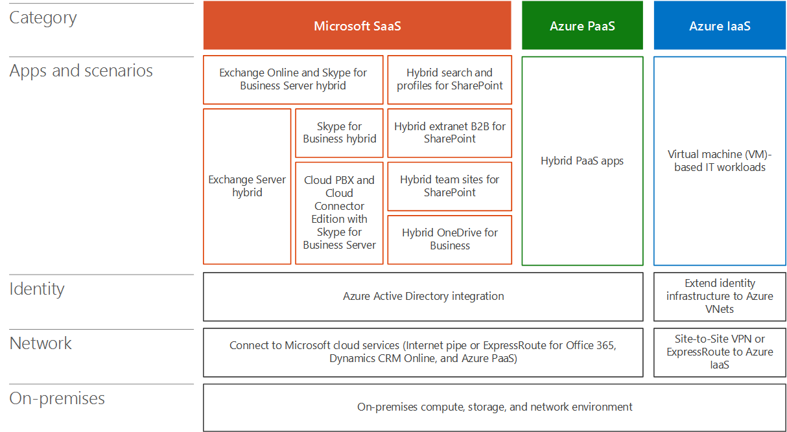

# Architecture of Microsoft hybrid cloud scenarios

 **Summary:** Understand the architecture of Microsoft's hybrid cloud offerings.
  
Use an architectural approach to plan and implement hybrid cloud scenarios with Microsoft cloud services and platforms.
  
**Figure 1: The Microsoft hybrid cloud stack**

  
Figure 1 shows the Microsoft hybrid cloud stack and its layer, which include on-premises, network, Identity, apps and scenarios, and the category of cloud service (Microsoft SaaS, Azure PaaS, and Azure PaaS).
  
The Apps and scenarios layer contains the specific hybrid cloud scenarios that are detailed in the additional articles of this model. The Identity, Network, and On-premises layers can be common to the categories of cloud service (SaaS, PaaS, or PaaS).
  
- On-premises
    
    On-premises infrastructure for hybrid scenarios can include servers for SharePoint, Exchange, Skype for Business, and line of business applications. It can also include data stores (databases, lists, files). Without ExpressRoute connections, access to the on-premises data stores must be allowed through a reverse proxy or by making the server or data accessible on your DMZ or extranet.
    
- Network
    
    There are two choices for connectivity to Microsoft cloud platforms and services: your existing Internet pipe and ExpressRoute. Use an ExpressRoute connection if predictable performance is important. You can use one ExpressRoute connection to connect directly to Microsoft SaaS services (Office 365 and Dynamics 365), Azure PaaS services, and Azure PaaS services.
    
- Identity
    
    For cloud identity infrastructure, there are two ways to go, depending on the Microsoft cloud platform. For SaaS and Azure PaaS, integrate your on-premises identity infrastructure with Azure AD or federate with your on-premises identity infrastructure or third-party identity providers. For VMs running in Azure, you can extend your on-premises identity infrastructure, such as Windows Server AD, to the virtual networks (VNets) where your VMs reside.
    
## Hybrid cloud scenarios for the three-phase cloud adoption process

Many enterprises, including Microsoft's, use a three-phase approach to adopting the cloud. Hybrid cloud scenarios can play a role in each phase.
  
1. Move productivity workloads to SaaS
    
    For productivity workloads that currently are or must stay on-premises, hybrid scenarios allow them to be integrated with their cloud counterparts.
    
2. Develop new and modern applications in Azure PaaS
    
    Azure PaaS hybrid applications can securely leverage on-premises server or storage resources.
    
3. Move existing applications to Azure IaaS
    
    For lift-and-shift and build-in-the-cloud scenarios, server-based applications running on Azure VMs provide easy provisioning and scaling.
    
## See Also

#### 

[Microsoft Hybrid Cloud for Enterprise Architects](microsoft-hybrid-cloud-for-enterprise-architects.md)
  
[Microsoft Cloud IT architecture resources](microsoft-cloud-it-architecture-resources.md)

[Microsoft's Enterprise Cloud Roadmap: Resources for IT Decision Makers](https://sway.com/FJ2xsyWtkJc2taRD)

#### 

