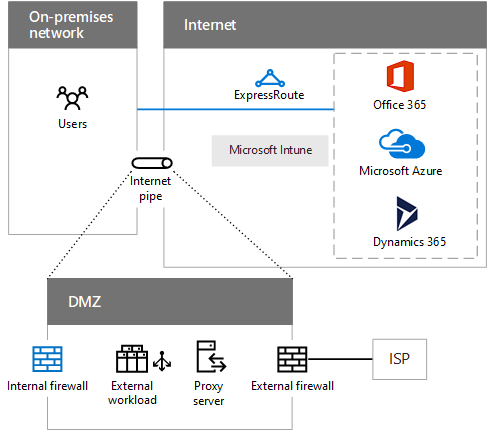

# Common elements of Microsoft cloud connectivity

 **Summary:** Understand the common elements of networking infrastructure and how to prepare your network.
  
Integrating your networking with the Microsoft cloud provides optimal access to a broad range of services.
  
## Steps to prepare your network for Microsoft cloud services

For your on-premises network:
  
1. Analyze your client computers and optimize for network hardware, software drivers, protocol settings, and Internet browsers.
    
2. Analyze your on-premises network for traffic latency and optimal routing to the Internet edge device.
    
3. Analyze the capacity and performance of your Internet edge device and optimize for higher levels of traffic.
    
For your Internet connection:
  
1. Analyze the latency between your Internet edge device (such as your external firewall) and the regional locations of the Microsoft cloud service to which you are connecting.
    
2. Analyze the capacity and utilization of your current Internet connection and add capacity if needed. Alternately, add an ExpressRoute connection.
    
## Microsoft cloud connectivity options

Use your existing Internet pipe or an ExpressRoute connection to Office 365, Azure, and Dynamics 365.
  
**Figure 1: Options for Microsoft cloud connectivity**

  
Figure 1 shows how an on-premises network can be connected to Microsoft cloud offerings using their existing Internet pipe or ExpressRoute. The Internet pipe represents a DMZ and can have the following components:
  
- **Internal firewall:** A barrier between your trusted network and an untrusted one. Performs traffic filtering (based on rules) and monitoring.
    
- **External workload:** Web sites or other workloads made available to external users on the Internet.
    
- **Proxy server:** Services requests for web content on behalf of intranet users. A reverse proxy allows unsolicited inbound requests.
    
- **External firewall:** Allows outbound traffic and specified inbound traffic. Can perform address translation.
    
- **WAN connection to ISP:** A carrier-based connection to an ISP, who peers with the Internet for connectivity and routing.
    
## Areas of networking common to all Microsoft cloud services

You need to consider these areas of networking when adopting any of Microsoft's cloud services.
  
- **Intranet performance:** Performance to Internet-based resources will suffer if your intranet, including client computers, is not optimized.
    
- **Edge devices:** Devices at the edge of your network are egress points and can include Network Address Translators (NATs), proxy servers (including reverse proxies), firewalls, intrusion detection devices, or a combination.
    
- **Internet connection:** Your WAN connection to your ISP and the Internet should have enough capacity to handle peak loads. You can also use an ExpressRoute connection.
    
- **Internet DNS:** A, AAAA, CNAME, MX, PTR and other records to locate Microsoft cloud or your services hosted in the cloud. For example, you might need a CNAME record for your app hosted in Azure PaaS.
    

## Next step

[ExpressRoute for Microsoft cloud connectivity](expressroute-for-microsoft-cloud-connectivity.md)

## See also

[Microsoft Cloud Networking for Enterprise Architects](microsoft-cloud-networking-for-enterprise-architects.md)
  
[Microsoft Cloud IT architecture resources](microsoft-cloud-it-architecture-resources.md)

