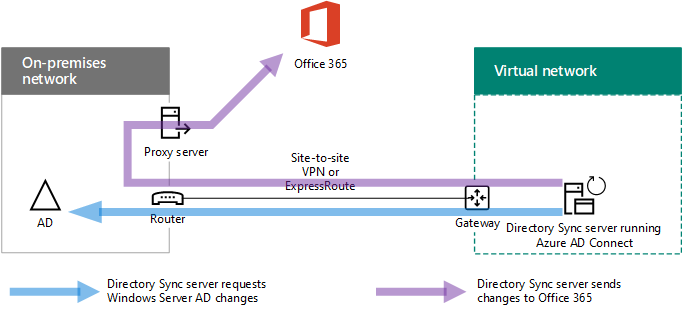
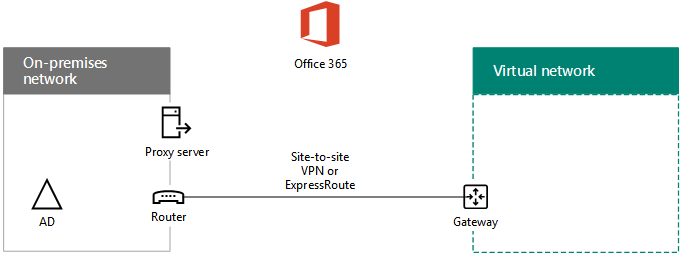
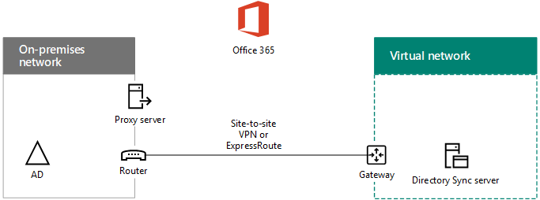
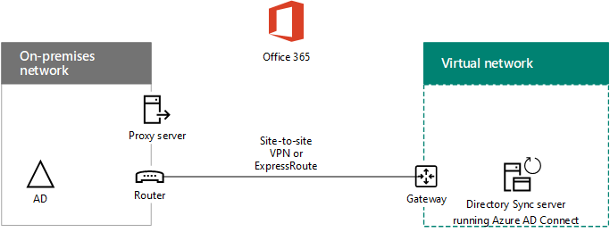

# Deploy Office 365 Directory Synchronization in Microsoft Azure

 **Summary:** Deploy Azure AD Connect on a virtual machine in Azure to synchronize accounts between your on-premises directory and the Azure AD tenant of your Office 365 subscription.
  
Azure Active Directory (AD) Connect (formerly known as the Directory Synchronization tool, Directory Sync tool, or the DirSync.exe tool) is a server-based application that you install on a domain-joined server to synchronize your on-premises Windows Server Active Directory users to the Azure Active Directory tenant of your Office 365 subscription. You can install Azure AD Connect on a on-premises server, but you can also install it on a virtual machine in Azure for the following reasons:
  
- You can provision and configure cloud-based servers faster, making the services available to your users sooner.
    
- Azure offers better site availability with less effort.
    
- You can reduce the number of on-premises servers in your organization.
    
> [!IMPORTANT]
> This solution requires connectivity between your on-premises network and your Azure Virtual Network. For more information, see [Connect an on-premises network to a Microsoft Azure virtual network](connect-an-on-premises-network-to-a-microsoft-azure-virtual-network.md). 
  
> [!IMPORTANT]
> This article describes synchronization of a single domain in a single forest. Azure AD Connect synchronizes all Windows Server AD domains in your Active Directory forest with Office 365. If you have multiple Active Directory forests to synchronize with Office 365, see [Multi-forest Directory Sync with Single Sign-On Scenario](https://go.microsoft.com/fwlink/p/?LinkId=393091). 
  
> [!NOTE]
> Office 365 uses Azure Active Directory (Azure AD) for its directory service. Your Office 365 subscription includes an Azure AD tenant. This tenant can also be used for management of your organization's identities with other cloud workloads, including other SaaS applications and apps in Azure. 
  
## Overview of deploying Office 365 directory synchronization in Azure

The following diagram shows Azure AD Connect running on a virtual machine in Azure (the directory sync server) that synchronizes an on-premises Windows Server AD forest to anOffice 365 subscription.
  

  
In the diagram, there are two networks connected by a site-to-site VPN or ExpressRoute connection. There is an on-premises network where Windows Server AD domain controllers are located, and there is an Azure virtual network with a directory sync server, which is a virtual machine running [Azure AD Connect](https://www.microsoft.com/download/details.aspx?id=47594). There are two main traffic flows originating from the directory sync server:
  
-  Azure AD Connect queries a domain controller on the on-premises network for changes to accounts and passwords.
    
-  Azure AD Connect sends the changes to accounts and passwords to the Azure AD instance of your Office 365 subscription. Because the directory sync server is in an extended portion of your on-premises network, these changes are sent through the on-premises network's proxy server.
    
> [!NOTE]
> This solution describes synchronization of a single Active Directory domain, in a single Active Directory forest. Azure AD Connect synchronizes all Active Directory domains in your Active Directory forest with Office 365. If you have multiple Active Directory forests to synchronize with Office 365, see [Multi-forest Directory Sync with Single Sign-On Scenario](https://go.microsoft.com/fwlink/p/?LinkId=393091). 
  
In both cases, the traffic originated by Azure AD Connect running on the Azure virtual machine is forwarded to a gateway on the virtual network in Azure, which then forwards the traffic across the site-to-site VPN or ExpressRoute connection to the VPN gateway device on the on-premises network. The routing infrastructure of the on-premises network then forwards the traffic to its destination, such as a domain controller or a proxy server.
  
There are two major steps when you deploy this solution:
  
1. Create an Azure virtual network and establish a site-to-site VPN connection to your on-premises network. For more information, see [Connect an on-premises network to a Microsoft Azure virtual network](connect-an-on-premises-network-to-a-microsoft-azure-virtual-network.md).
    
2. Install [Azure AD Connect](https://www.microsoft.com/download/details.aspx?id=47594) on a domain-joined virtual machine in Azure, and then synchronize the on-premises Windows Server AD to Office 365. This involves:
    
    Creating an Azure Virtual Machine to run Azure AD Connect.
    
    Installing and configuring [Azure AD Connect](https://www.microsoft.com/download/details.aspx?id=47594).
    
    Configuring Azure AD Connect requires the credentials (user name and password) of an Azure AD administrator account and a Windows Server AD enterprise administrator account. Azure AD Connect runs immediately and on an ongoing basis to synchronize the on-premises Windows Server AD forest to Office 365.
    
Before you deploy this solution in production, use the instructions in [Directory synchronization for your Office 365 dev/test environment](dirsync-for-your-office-365-dev-test-environment.md) to set this configuration up as a proof of concept, for demonstrations, or for experimentation.
  
> [!IMPORTANT]
> When Azure AD Connect configuration completes, it does not save the Windows Server AD enterprise administrator account credentials. 
  
> [!NOTE]
> This solution describes synchronizing a single Windows Server AD forest to Office 365. The topology discussed in this article represents only one way to implement this solution. Your organization's topology might differ based on your unique network requirements and security considerations. 
  
## Plan for hosting a directory sync server for Office 365 in Azure

### Prerequisites

Before you begin, review the following prerequisites for this solution:
  
- Review the related planning content in [Plan your Azure virtual network](connect-an-on-premises-network-to-a-microsoft-azure-virtual-network.md#PlanningVirtual).
    
- Ensure that you meet all [prerequisites](connect-an-on-premises-network-to-a-microsoft-azure-virtual-network.md#Prerequisites) for configuring the Azure virtual network.
    
- Have an Office 365 subscription that includes the Active Directory integration feature. For information about Office 365 subscriptions, go to the [Office 365 subscription page](https://go.microsoft.com/fwlink/p/?LinkId=394278).
    
- Provision one Azure Virtual Machine that runs Azure AD Connect to synchronize your on-premises Windows Server AD forest with Office 365.
    
    You must have the credentials (names and passwords) for a Windows Server AD enterprise administrator account and an Azure Active Directory Administrator account.
    
### Solution architecture design assumptions

The following list describes the design choices made for this solution.
  
- This solution uses a single Azure virtual network with a site-to-site VPN connection. The Azure virtual network hosts a single subnet that contains one server, the directory sync server that is running Azure AD Connect. 
    
- On the on-premises network, a domain controller and DNS servers exist.
    
- Azure AD Connect performs password hash synchronization instead of single sign-on. You do not have to deploy an Active Directory Federation Services (AD FS) infrastructure. To learn more about password hash synchronization and single sign-on options, see [Choosing the right authentication method for your Azure Active Directory hybrid identity solution](http://aka.ms/auth-options).
    
There are additional design choices that you might consider when you deploy this solution in your environment. These include the following:
  
- If there are existing DNS servers in an existing Azure virtual network, determine whether you want your directory sync server to use them for name resolution instead of DNS servers on the on-premises network.
    
- If there are domain controllers in an existing Azure virtual network, determine whether configuring Active Directory Sites and Services may be a better option for you. The directory sync server can query the domain controllers in the Azure virtual network for changes in accounts and passwords instead of domain controllers on the on-premises network.
    
## Deployment roadmap

Deploying Azure AD Connect on a virtual machine in Azure consists of three phases:
  
- Phase 1: Create and configure the Azure virtual network
    
- Phase 2: Create and configure the Azure virtual machine
    
- Phase 3: Install and configure Azure AD Connect
    
After deployment, you must also assign locations and licenses for the new user accounts in Office 365.
  
> [!TIP]
> The [Directory Synchronization Server in Azure Deployment Kit](https://gallery.technet.microsoft.com/DirSync-Server-in-Azure-32cb2ded) contains all of the Azure PowerShell blocks to build out this solution, the diagrams in Microsoft PowerPoint and Visio format, and a Microsoft Excel configuration workbook that generates Azure PowerShell command blocks customized for your settings.
  
### Phase 1: Create and configure the Azure virtual network

To create and configure the Azure virtual network, complete [Phase 1: Prepare your on-premises network](connect-an-on-premises-network-to-a-microsoft-azure-virtual-network.md#Phase1) and [Phase 2: Create the cross-premises virtual network in Azure](connect-an-on-premises-network-to-a-microsoft-azure-virtual-network.md#Phase2) in the deployment roadmap of [Connect an on-premises network to a Microsoft Azure virtual network](connect-an-on-premises-network-to-a-microsoft-azure-virtual-network.md).
  
This is your resulting configuration.
  

  
This figure shows an on-premises network connected to an Azure virtual network through a site-to-site VPN or ExpressRoute connection.
  
### Phase 2: Create and configure the Azure virtual machine

Create the virtual machine in Azure using the instructions [Create your first Windows virtual machine in the Azure portal](https://go.microsoft.com/fwlink/p/?LinkId=393098). Use the following settings:
  
- On the **Basics** pane, select the same subscription, location, and resource group as your virtual network. Record the user name and password in a secure location. You will need these later to connect to the virtual machine.
    
- On the **Choose a size** pane, choose the **A2 Standard** size.
    
- On the **Settings** pane, in the **Storage** section, select the **Standard** storage type. In the **Network** section, select the name of your virtual network and the subnet for hosting the directory sync server (not the GatewaySubnet). Leave all other settings at their default values.
    
Verify that your directory sync server is using DNS correctly by checking your internal DNS to make sure that an Address (A) record was added for the virtual machine with its IP address. 
  
Use the instructions in [Connect to the virtual machine and sign on](https://docs.microsoft.com/azure/virtual-machines/virtual-machines-windows-hero-tutorial?toc=%2fazure%2fvirtual-machines%2fwindows%2ftoc.json#connect-to-the-virtual-machine-and-sign-on) to connect to the directory sync server with a Remote Desktop Connection. After signing in, join the virtual machine to the on-premises Windows Server AD domain.
  
For Azure AD Connect to gain access to Internet resources, you must configure the directory sync server to use the on-premises network's proxy server. You should contact your network administrator for any additional configuration steps to perform.
  
This is your resulting configuration.
  

  
This figure shows the directory sync server virtual machine in the cross-premises Azure virtual network.
  
### Phase 3: Install and configure Azure AD Connect

Complete the following procedure:
  
1. Connect to the directory sync server using a Remote Desktop Connection with a Windows Server AD domain account that has local administrator privileges. See [Connect to the virtual machine and sign on](https://docs.microsoft.com/azure/virtual-machines/virtual-machines-windows-hero-tutorial?toc=%2fazure%2fvirtual-machines%2fwindows%2ftoc.json#connect-to-the-virtual-machine-and-sign-on).
    
2. From the directory sync server, open the [Set up directory synchronization in Office 365](https://support.office.com/article/Set-up-directory-synchronization-in-Office-365-1b3b5318-6977-42ed-b5c7-96fa74b08846) article and follow the directions for directory synchronization with password hash synchronization.
    
> [!CAUTION]
> Setup creates the **AAD_xxxxxxxxxxxx** account in the Local Users organizational unit (OU). Do not move or remove this account or synchronization will fail.
  
This is your resulting configuration.
  

  
This figure shows the directory sync server with Azure AD Connect in the cross-premises Azure virtual network.
  
### Assign locations and licenses to users in Office 365

Azure AD Connect adds accounts to your Office 365 subscription from the on-premises Windows Server AD, but in order for users to sign in to Office 365 and use its services, the accounts must configured with a location and licenses. Use these steps to add the location and activate licenses for the appropriate user accounts:
  
1. Sign in to the [Office 365 portal page](https://portal.office.com), and then click **Admin**.
    
2. In the left navigation, click **Users > Active users**.
    
3. In the list of user accounts, select the check box next to the user you want to activate.
    
4. On the page for the user, click **Edit** for **Product licenses**.
    
5. On the **Product licences** page, select a location for the user for **Location**, and then enable the appropriate licences for the user.
    
6. When complete, click **Save**, and then click **Close** twice.
    
7. Go back to step 3 for additional users.
    
## See Also

[Cloud adoption and hybrid solutions](cloud-adoption-and-hybrid-solutions.md)
  
[Connect an on-premises network to a Microsoft Azure virtual network](connect-an-on-premises-network-to-a-microsoft-azure-virtual-network.md)

[Download Azure AD Connect](https://www.microsoft.com/download/details.aspx?id=47594)
  
[Set up directory synchronization in Office 365](https://support.office.com/article/Set-up-directory-synchronization-in-Office-365-1b3b5318-6977-42ed-b5c7-96fa74b08846)
  
[Directory Synchronization server in Azure Deployment Kit](https://gallery.technet.microsoft.com/DirSync-Server-in-Azure-32cb2ded)

