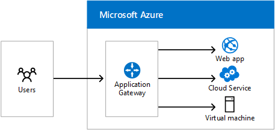
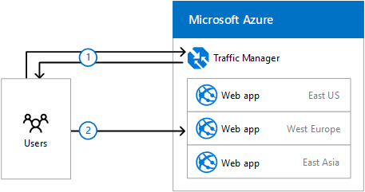

# Designing networking for Microsoft Azure PaaS

 **Summary:** Understand how to optimize your network for access to Microsoft Azure PaaS.
  
Optimizing networking for Azure PaaS apps requires adequate Internet bandwidth and can require the distribution of network traffic across multiple sites or apps.
  
## Planning steps for hosting organization PaaS applications in Azure

Insert section body here.
  
1. Go through the **Steps to prepare your network for Microsoft cloud services** section in[Common elements of Microsoft cloud connectivity](common-elements-of-microsoft-cloud-connectivity.md).
    
2. Optimize your Internet bandwidth using steps 2 - 4 of the **Steps to prepare your network for Microsoft SaaS services** section in[Designing networking for Microsoft SaaS](designing-networking-for-microsoft-saas.md).
    
3. Determine whether you need an ExpressRoute connection to Azure.
    
4. For web-based workloads, determine whether you need the Azure Application Gateway.
    
5. For distribution of traffic to different endpoints in different data centers, determine whether you need Azure Traffic Manager.
    
## Internet bandwidth for organization PaaS applications

Organization applications hosted in Azure PaaS require Internet bandwidth for intranet users. There are two options:
  
- **Option 1:** Use your existing pipe, optimized for Internet traffic with the capacity to handle peak loads. See[Designing networking for Microsoft SaaS](designing-networking-for-microsoft-saas.md) for Internet edge, client usage, and IT operations considerations.
    
- **Option 2:** For high-bandwidth or low latency needs, use an ExpressRoute connection to Azure.
    
**Figure 1: Connection options for connecting the Azure PaaS services**

  
Figure 1 shows an on-premises network connecting to Azure PaaS services over an Internet pipe or ExpressRoute.
  
## Azure Application Gateway

Application-level routing and load balancing services that let you build a scalable and highly-available web front end in Azure for web apps, cloud services, and virtual machines. 
  
**Figure 2: Azure Application Gateway**

  
Figure 2 shows the Azure Application Gateway and how user requests from the Internet can be routed to Azure web apps, cloud services, or virtual machines.
  
Application Gateway currently supports layer 7 application delivery for the following:
  
- HTTP load balancing
    
- Cookie-based session affinity
    
- SSL offload
    
For more information, see [Application Gateway](https://docs.microsoft.com/azure/application-gateway/application-gateway-introduction).
  
## Azure Traffic Manager

Distribution of traffic to different endpoints, which can include cloud services or Azure web apps located in different data centers or external endpoints.
  
Traffic Manager uses the following routing methods:
  
- **Failover:** The endpoints are in the same or different Azure datacenters and you want to use a primary endpoint for all traffic, but provide backups in case the primary or the backup endpoints are unavailable.
    
- **Round robin:** You want to distribute load across a set of endpoints in the same datacenter or across different datacenters.
    
- **Performance:** You have endpoints in different geographic locations and you want requesting clients to use the "closest" endpoint in terms of the lowest latency.
    
Here is an example for three geographically-distributed web apps.
  
**Figure 3: Azure Traffic Manager**

  
Figure 3 shows the basic process that Traffic Manager uses to route requests to three different Azure web apps in United States, Europe, and Asia. In the example:
  
1. A user DNS query for a web site URL gets directed to Azure Traffic Manager, which returns the name of a regional web app, based on the performance routing method.
    
2. The user initiates traffic with the regional web app in Europe.
    
For more information, see [Traffic Manager](https://docs.microsoft.com/azure/traffic-manager/traffic-manager-overview).
  
## See Also

#### 

[Microsoft Cloud Networking for Enterprise Architects](microsoft-cloud-networking-for-enterprise-architects.md)
  
[Microsoft Cloud IT architecture resources](microsoft-cloud-it-architecture-resources.md)

[Microsoft's Enterprise Cloud Roadmap: Resources for IT Decision Makers](https://sway.com/FJ2xsyWtkJc2taRD)

#### 

