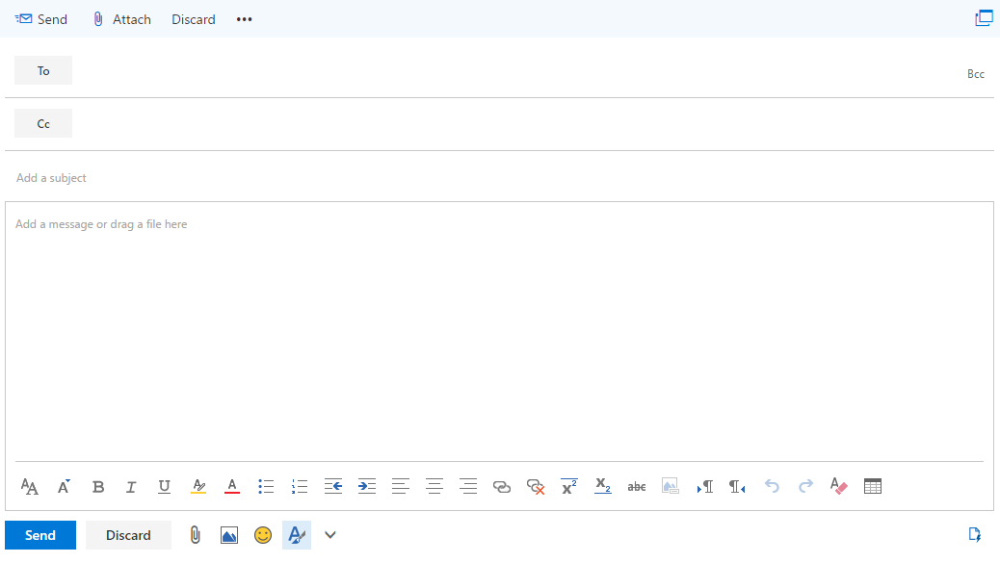
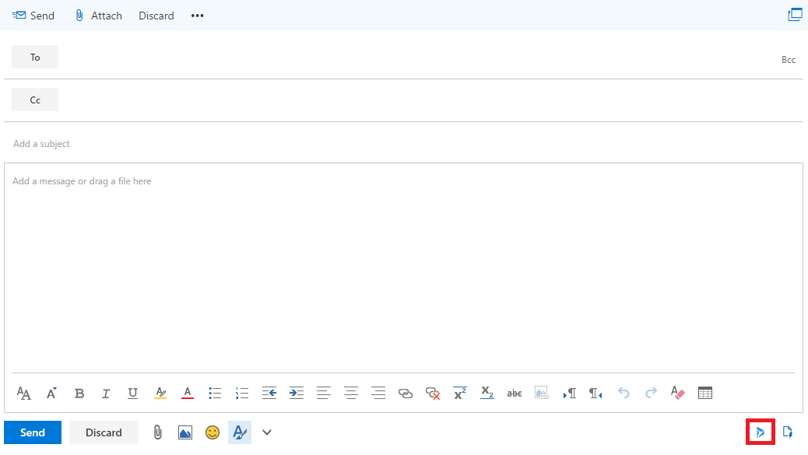
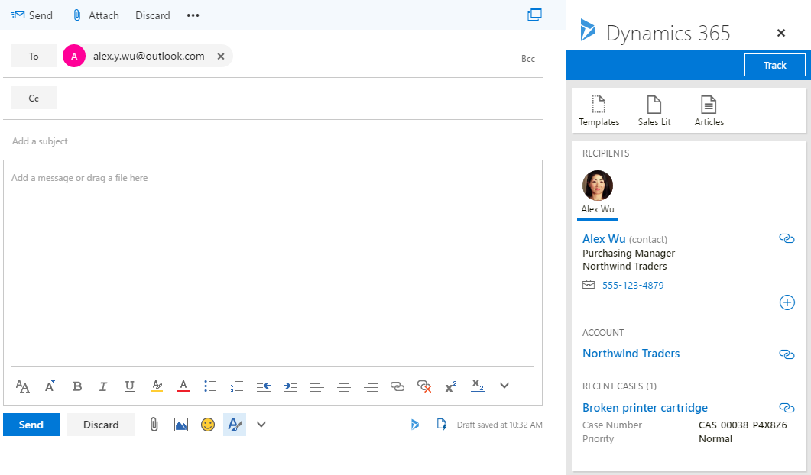

# Exchange Online integration for your Office 365 and Dynamics 365 dev/test environment

 **Summary:** Use this Test Lab Guide to enable Dynamics 365 integration for Exchange Online in your Office 365 trial subscription.
  
A valuable use of Microsoft Dynamics 365 is to store all customer communications in one place, so anyone with the appropriate permissions can see all relevant customer records. For example, view all email associated with a particular contact, account, opportunity, or case.
  
To store email and other messaging records in Dynamics 365, you need to synchronize your email system with Dynamics 365. Server-side synchronization is the method of choice for email synchronization.
  
Use this Test Lab Guide to configure and demonstrate how Exchange Online and the Outlook Online client can leverage the information stored in Dynamics 365. 
  
## Phase 1: Build out the Office 365 and Dynamics 365 dev/test environment

Use the instructions in [Office 365 and Dynamics 365 dev/test environment](office-365-and-dynamics-365-dev-test-environment.md) to create either a lightweight or simulated enterprise version of an Office 365 and Dynamics 365 dev/test environment.
  
> [!NOTE]
> The configuration in this article does not require the simulated enterprise dev/test environment, which includes a simulated intranet connected to the Internet and directory synchronization for a Windows Server Active Directory (AD) forest. It is provided here as an option so that you can experiment with Office 365 and Dynamics 365 in an environment that represents a typical organization 
  
## Phase 2: Configure and demonstrate Dynamics 365 integration in Exchange Online

Use these steps to configure the global administrator's mailbox for Dynamics 365 and Exchange Online integration:
  
1. Using a private session of your browser, go to [http://portal.office.com](http://portal.office.com) and sign in using your Office 365 global administrator account.
    
2. On the **Microsoft Office Home** page, click the **Mail** tile.
    
3. On the new **Mail** tab in your browser, click **New** and notice how the bottom corner of the pane below the box for typing a message contains an icon for My Templates.
    
     
  
4. Click **Discard** and leave the **Mail** tab open.
    
5. Click the **Microsoft Office Home** tab in your browser, and then click the **Admin** tile.
    
6. In the left navigation of the **Office Admin center** tab, click **Admin centers > Dynamics 365**.
    
7. On the new **Dynamics 365** tab in your browser, in the list of Dynamics 365 instances, click **Open**.
    
8. On the new **Administration** tab in your browser, on the navigation bar, click the down arrow next to **Settings**, and then click **Email Configuration** under **System**.
    
9.  On the **Email Configuration** page, click **Email Configuration Settings**.
    
10. In the **Email** tab on the **System Settings** dialog box, change **Appointments, Contacts, and Tasks** to **Server-Side Synchronization**, and then click **OK**.
    
11. On the **Email Configuration** page, click **Mailboxes**.
    
12. Select the Office 365 global administrator name in the left check mark column, click **Apply Default Email Settings** in the tool bar, and then click **OK**.
    
13. Click **Approve Email** in the tool bar, and then click **OK**.
    
14. Select the Office 365 global administrator name in the left check mark column, click **Test &amp; Enable Mailboxes** in the tool bar, and then click **OK**.
    
15. Click the open **Mail** tab and confirm that the global administrator received a test message.
    
16. Return to the **Mailboxes My Active Mailboxes** tab in your browser and refresh the page. The **Incoming Email Status** and **Outgoing Email Status** columns should be set to **Success** for the global administrator account name. Note that it can take up to 15 minutes to complete both tests.
    
Use these steps to install the Dynamics 365 App for Outlook and demonstrate Dynamics 365 features within the global administrator's mailbox:
  
1. On the **Mailboxes My Active Mailboxes** tab in your browser, click the down arrow next to **Settings**, and then click **Dynamics 365 App for Outlook** under **System**.
    
2. On the **Getting Started with Microsoft Dynamics 365 App for Outlook** page, click the global administrator name, and then click **Add App to Outlook**. The **Status** column changes to **Pending**.
    
3. Refresh the page until the status changes to **Added to Outlook**. Note that it can take up to 15 minutes to complete this configuration.
    
4. Click on the **Mail** tab in your browser and then close it.
    
5. Click the **Microsoft Office Home** tab in your browser, and then click the **Mail** tile.
    
6. On the new **Mail** tab in your browser, click **New**. Notice that the bottom corner of the pane below the box for typing a message now contains an icon for Dynamics 365.
    
     
  
7. Click the Dynamics 365 icon. You should see a **Dynamics 365** pane, from which you can track this email or access templates, sales literature, or articles.
    
8. In the **To** field of the email message, type **alex.y.wu@outlook.com**, and then click **Retry** in the **Dynamics 365** pane. You should see a **Recipients** section in the **Dynamics 365** pane with information on Alex Wu, a contact from the sales application that was provided with the sample data for your trial subscription.
    
     
  
9. Click **Discard**.

> [!TIP]
> Click [here](http://aka.ms/catlgstack) for a visual map to all of the articles in the One Microsoft Cloud Test Lab Guide stack.
    
## See Also

[Office 365 and Dynamics 365 dev/test environment](office-365-and-dynamics-365-dev-test-environment.md)
  
[Cloud adoption Test Lab Guides (TLGs)](cloud-adoption-test-lab-guides-tlgs.md)
  
[Base Configuration dev/test environment](base-configuration-dev-test-environment.md)
  
[Office 365 dev/test environment](office-365-dev-test-environment.md)
  
[DirSync for your Office 365 dev/test environment](dirsync-for-your-office-365-dev-test-environment.md)

[Subscription Management for Dynamics 365 (online)](https://technet.microsoft.com/library/jj679903.aspx)
  
[Administering Dynamics 365](https://technet.microsoft.com/library/dn531101.aspx)

