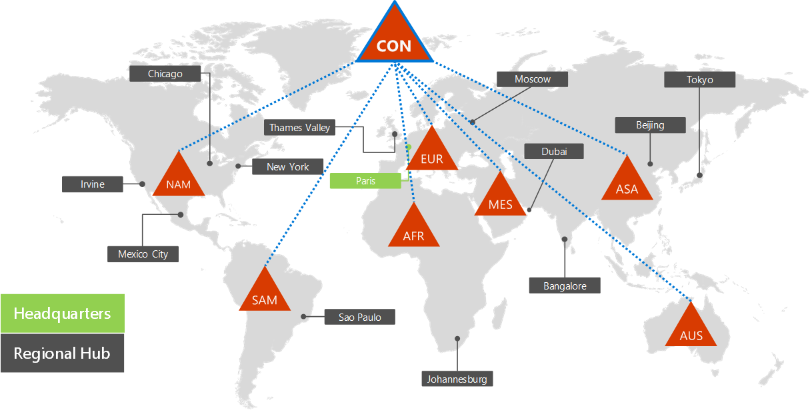
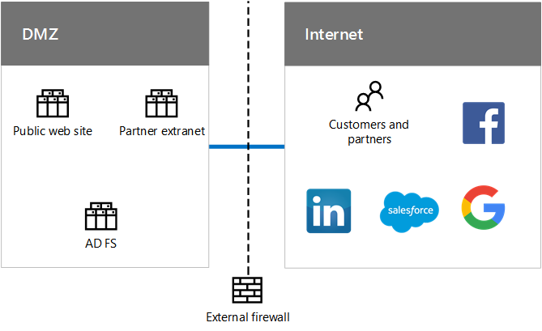
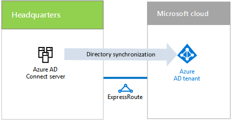
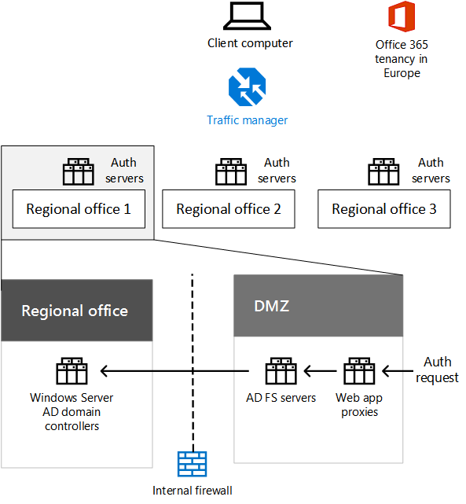
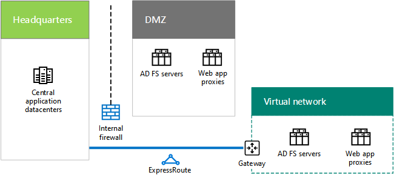

# Identity for the Contoso Corporation

 **Summary:** Understand how Contoso takes advantage of IDaaS and provides geographically distributed and redundant authentication for its users.
  
Microsoft provides an Identity as a Service (IDaaS) across its cloud offerings. To adopt a cloud-inclusive infrastructure, Contoso's IDaaS solution must leverage their on-premises identity provider and include federated authentication with their existing trusted, third-party identity providers.
  
## Contoso's Windows Server AD forest

Contoso uses a single Windows Server Active Directory (AD) forest for contoso.com with seven domains, one for each region of the world. The headquarters, regional hub offices, and satellite offices contain domain controllers for local authentication and authorization.
  
**Figure 1: Contoso's forest and domains worldwide**

  
Figure 1 shows the Contoso forest with regional domains for the different parts of the world that contain regional hubs.
  
Contoso wants to use the accounts and groups in the contoso.com forest for authentication and authorization for its cloud-based apps and workloads.
  
## Contoso's federated authentication infrastructure

Contoso allows:
  
- Customers to use their Microsoft, Facebook, or Google Mail accounts to sign in to their public web site.
    
- Vendors and partners to use their LinkedIn, Salesforce, or Google Mail accounts to sign in to the partner extranet.
    
**Figure 2: Contoso's support for federated authentication for customers and partners**

  
Figure 2 shows the Contoso DMZ containing a public web site, a partner extranet, and a set of AD FS servers. The DMZ is connected to the Internet that contains customers and partners and Internet services.
  
Active Directory Federation Services (AD FS) servers in the DMZ authenticate customer credentials for access to the public web site and partner credentials for access to the partner extranet.
  
When Contoso transitions its public web site to an Azure Web App and partner extranet to Dynamics 365, they want to continue to use these third-party identity providers for their customers and partners. This will be accomplished by configuring federation between Contoso Azure AD tenants and these third-party identity providers.
  
## Directory synchronization for Contoso's Windows Server AD forest

Contoso has deployed the Azure AD Connect tool on a cluster of servers in its Paris datacenter. Azure AD Connect synchronizes changes to the contoso.com Windows Server AD forest with the Azure AD tenant shared by Contoso's Office 365, EMS, Dynamics 365, and Azure subscriptions. For more information about subscriptions, licenses, user accounts, and tenants, see [Subscriptions, licenses, and user accounts for the Contoso Corporation](subscriptions-licenses-and-user-accounts-for-the-contoso-corporation.md).
  
**Figure 3: Contoso's directory synchronization infrastructure**

  
Figure 3 shows a cluster of servers running Azure AD Connect synchronizing the Contoso Windows Server AD forest with the Azure AD tenant.
  
Contoso has configured federated authentication, which provides single sign-on for Contoso's workers. When a user that has already signed in to the contoso.com Windows Server AD forest accesses a Microsoft SaaS or PaaS cloud resource, they will not be prompted for a password.
  
## Geographical distribution of Contoso authentication traffic

To better support its mobile and remote workforce, Contoso has deployed sets of authentication servers in its regional offices. This infrastructure distributes the load and provides redundancy and higher performance when authenticating user credentials for access to Microsoft cloud offerings that use the common Azure AD tenant.
  
To distribute the load of authentication requests, Contoso has configured Azure Traffic Manager with a profile that uses the performance routing method, which refers authenticating clients to the regionally closest set of authentication servers. 
  
**Figure 4: Geographical distribution of authentication traffic for regional offices**

  
Figure 4 shows the layers of client computers, Azure Traffic Manager, and authentication servers in regional offices. Each regional office uses web proxies and AD FS servers to authenticate user credentials with Windows Server AD domain controllers.
  
Authentication process example:
  
1. The client computer initiates communication with a web page in the Office 365 tenancy in Europe (such as sharepoint.contoso.com).
    
2. Office 365 sends back a request to send proof of authentication. The request contains the URL to contact for authentication.
    
3. The client computer attempts to resolve the DNS name in the URL to an IP address.
    
4. Azure Traffic Manager receives the DNS query and responds to the client computer with the IP address of a web application proxy server in the regional office that is closest to the client computer.
    
5.  The client computer sends an authentication request to a web application proxy server, which forwards the request to an AD FS server.
    
6. The AD FS server requests the user credentials from the client computer.
    
7. The client computer sends the user credentials without prompting the user.
    
8. The AD FS server validates the credentials with a Windows Server AD domain controller in the regional office and returns a security token to the client computer.
    
9. The client computer sends the security token to Office 365.
    
10. After successful validation, Office 365 caches the security token and sends the web page requested in step 1 to the client computer.
    
## Redundancy for the headquarters authentication infrastructure in Azure IaaS

To provide redundancy for the remote and mobile workers of the Paris headquarters that contains 15,000 workers, Contoso has deployed a second set of application proxies and AD FS servers in Azure IaaS.
  
**Figure 5: Redundant authentication infrastructure in Azure IaaS**

  
Figure 5 shows web proxies and AD FS servers in the DMZ and an additional set of each in a cross-premises Azure virtual network.
  
When the primary authentication servers in the headquarters DMZ become unavailable, IT staff switch over to the redundant set deployed in Azure IaaS. Subsequent authentication requests from Paris office computers use the set in Azure IaaS until the availability problem is corrected.
  
To switch over and switch back, Contoso updates the Azure Traffic Manager profile for the Paris region to use a different set of IP addresses for the web application proxies:
  
- When the DMZ authentication servers are available, use the IP addresses of the servers in the DMZ.
    
- When the DMZ authentication servers are not available, use the IP addresses of the servers in Azure IaaS.
    
## See Also

[Contoso in the Microsoft Cloud](contoso-in-the-microsoft-cloud.md)
  
[Microsoft Cloud IT architecture resources](microsoft-cloud-it-architecture-resources.md)

[Microsoft Cloud Identity for Enterprise Architects](http://aka.ms/cloudarchidentity)
  
[Identity and Device Protection for Office 365](http://aka.ms/o365protect_device)
  
[Microsoft's Enterprise Cloud Roadmap: Resources for IT Decision Makers](https://sway.com/FJ2xsyWtkJc2taRD)

#### 

