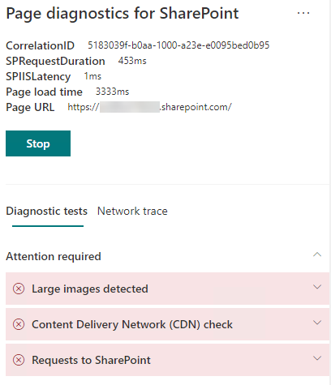

# Optimize web part performance in SharePoint Online modern portal and classic publishing site pages

Both SharePoint Online modern portal pages and classic publishing sites contain web parts that can contribute to overall page load times. This article will help you understand how to determine how web parts in your pages affect user perceived latency, and how to remediate common issues.

>[!NOTE]
>For more information about performance in SharePoint Online modern portals, see [Performance in the modern SharePoint experience](https://docs.microsoft.com/en-us/sharepoint/modern-experience-performance).

## Use the Page Diagnostic Tool to analyze web parts

The Page Diagnostic Tool is a browser extension for Chrome and [Microsoft Edge version 77 or later](https://www.microsoftedgeinsider.com/en-us/download?form=MI13E8&OCID=MI13E8) you can use to analyze SharePoint both modern portal pages and classic publishing site pages. The tool provides a report for each analyzed page showing how the page performs against a defined set of performance criteria. To install and learn about the Page Diagnostic Tool, visit [Use the Page Diagnostics tool for SharePoint Online](page-diagnostics-for-spo.md).

When you analyze a SharePoint modern portal page with the Page Diagnostic Tool, you can see information about web parts in the **No web parts impacting page load time** result in the _Diagnostic tests_ view of the results pane.

Possible results include:

- **No attention required (green)**: No web part takes longer than **2** seconds to return data
- **Improvement opportunities (yellow)**: At least one _OOTB_ web part takes longer than **2** seconds to return data
- **Attention required (red)**: At least one _custom_ web part takes longer than **2** seconds to return data

The baseline metric is the same for modern and classic pages.

If the **Web parts impacting page load time** result appears in either the **Attention required** or **Improvement opportunities** section of the results, you can click the result to see details about the web parts that are slow.

## Remediate web part performance issues

If a page contains any web parts that take longer than 2 seconds to load, you can use the **No web parts impacting page load time** results in the Page Diagnostic Tool to determine which web parts are slow. Before you make your revisions, make a note of the page load time in the analysis results. Run the tool again after your revision to see if the new result is within the baseline standard, and check the new page load time to see if there was an improvement.

>[!NOTE]
>Page load time can vary based on a variety of factors such as network load, time of day, and other transient conditions. You should test page load time a few times before and after making changes to help you average the results.

There are three categories of possible causes for poor web part performance. Use the information below to determine which issues apply to your scenario and remediate them.

- Web part script size and dependencies
  - Optimize the initial script that renders the mainline scenario for _view mode only_.
  - Move the less frequent scenarios and edit mode code (like the property pane) to separate chunks using the _import()_ statement.
  - Review dependencies of the _package.json_ file to remove any dead code completely. Move any test/build only dependencies to devDependencies.
  - Use of the Office 365 CDN is required for optimal static resource download. Public CDN origins are preferable for _js/css_ files. For more information about using the Office 365 CDN, see [Use the Office 365 Content Delivery Network (CDN) with SharePoint Online](use-office-365-cdn-with-spo.md).
  - Reuse frameworks like _React_ and _Fabric imports_ that come as part of the SharePoint Framework (SPFx). For more information, see [Overview of the SharePoint Framework](https://docs.microsoft.com/en-us/sharepoint/dev/spfx/sharepoint-framework-overview).
  - Ensure that you are using the latest version of the SharePoint Framework, and upgrade to new versions as they become available.
- Data fetching/caching
  - If the web part relies on extra server calls to fetch data for display, ensure those server APIs are fast and/or implement client side caching (such as using _localStorage_ or _IndexDB_ for larger sets).
  - If multiple calls are required to render critical data, consider batching on the server or other methods of consolidating requests to a single call.
  - Alternatively, if some elements of data require a slower API, but are not critical to initial rendering, decouple these to a separate call that is executed after critical data is rendered.
  - If multiple parts use the same data, utilize a common data layer to avoid duplicate calls.
- Rendering time
  - Any media sources like images and videos should be sized to the limits of the container, device and/or network to avoid downloading unnecessary large assets. For more information about content dependencies, see [Use the Office 365 Content Delivery Network (CDN) with SharePoint Online](use-office-365-cdn-with-spo.md).
  - Avoid API calls that cause re-flow, complex CSS rules or complicated animations. For more information, see [Minimizing browser reflow](https://developers.google.com/speed/docs/insights/browser-reflow).
  - Avoid use of chained long running tasks. Instead, break long running tasks apart into separate queues. For more information, see [Optimize JavaScript Execution](https://developers.google.com/web/fundamentals/performance/rendering/optimize-javascript-execution).
  - Reserve corresponding space for asynchronously rendering media or visual elements to avoid skipped frames and stuttering (also known as _jank_).
  - If a certain browser doesn't support a feature used in rendering, either load a polyfill or exclude running dependent code. If the feature is not critical,
dispose resources such as event handlers to avoid memory leaks.

## Related topics

[Tune SharePoint Online performance](tune-sharepoint-online-performance.md)

[Tune Office 365 performance](tune-office-365-performance.md)

[Content delivery networks](content-delivery-networks.md)

[Performance in the modern SharePoint experience](https://docs.microsoft.com/en-us/sharepoint/modern-experience-performance.md)
