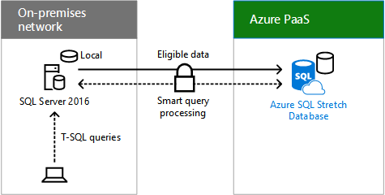
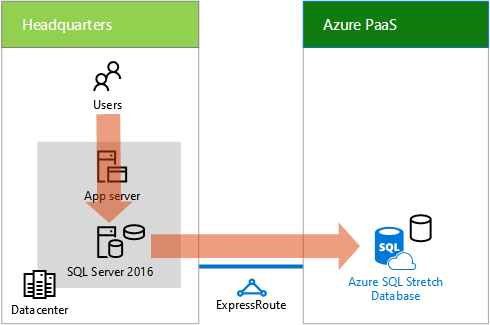

# Moving historical transaction data to the cloud

 **Summary:** How Contoso implemented SQL Server stretch database to reduce its on-premises data storage needs and daily running costs.
  
Contoso's enterprise storage system stores a large amount of historical transaction data for adherence with regulatory requirements and for marketing research and BI analysis of spending trends. Contoso also needs to restore archived data from magnetic tape, a time-intensive process. The hardware in Contoso's enterprise storage system was nearing its end of life and replacing it would be very expensive. 
  
As part of its business need to scale down its on-premises datacenters, Contoso chose to upgrade to SQL Server 2016 because of the Stretch Database hybrid feature and its seamless integration with Azure. Stretch Database allows Contoso to move the cold data in its tables from on-premises to cloud storage, freeing up local disk space and reducing maintenance. Both hot and cold data are in the same tables and are always available to applications and their users and for maintenance, such as backups and restores. Figure 1 shows Stretch Database.
  
**Figure 1: SQL Server Stretch Database**

  
Figure 1 shows how a SQL client sends T-SQL queries to a server running SQL Server 2016, which forwards them to an Azure SQL Stretch Database in Azure PaaS.
  
For more information, see [Stretch Database](https://msdn.microsoft.com/library/dn935011.aspx).
  
Contoso used these steps to move their historical data to the cloud:
  
1. Analyze databases
    
    Performed an analysis of the tables in the databases that they intended to move to the cloud and fixed any issues. The new Stretch Database Advisor gave them a full overview of what they can expect from all features in SQL Server 2016, including which tables have cold data that could be stretched.
    
2. Upgrade
    
    Updated existing SQL servers in the Paris headquarters datacenter to SQL Server 2016.
    
3. Migrate cold data to the cloud
    
    Using SQL Management Studio, they identified the databases to stretch and the tables to migrate to instances of Stretch Database in Azure. Over time and in the background, SQL Server 2016 moved the historical data to stretch databases in Azure.
    
Here is the resulting configuration for one server running SQL Server 2016 in the Paris headquarters.
  
**Figure 2: Using Stretch Database for a server in Contoso's datacenter**

  
Figure 2 shows how user queries to an application server in Contoso's datacenter become SQL queries that are passed to an Azure SQL Stretch Database in Azure PaaS.
  
Users access the data through existing apps and queries. Access policies remain the same. Moving forward, there is no need for tape backups. Maintenance consists of backing up and restoring hot data.
  
After implementing Stretch Database, Contoso:
  
- Reduced its on-premises data storage needs by 85%.
    
- Made the update of the enterprise storage system and reliance on magnetic tape archives unnecessary.
    
- Reduced its daily running costs significantly.
    
## See Also

#### 

[Enterprise scenarios for the Contoso Corporation](enterprise-scenarios-for-the-contoso-corporation.md)
  
[Contoso in the Microsoft Cloud](contoso-in-the-microsoft-cloud.md)
  
[Microsoft Cloud IT architecture resources](microsoft-cloud-it-architecture-resources.md)
#### 

[Stretch Database](https://msdn.microsoft.com/library/dn935011.aspx)
  
[Microsoft's Enterprise Cloud Roadmap: Resources for IT Decision Makers](https://sway.com/FJ2xsyWtkJc2taRD)

