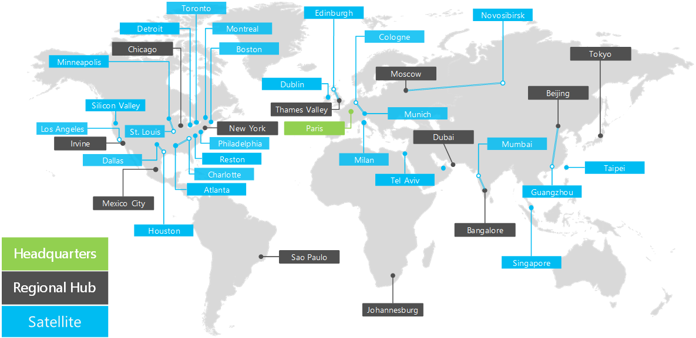

# Overview of the Contoso Corporation

 **Summary:** Understand the Contoso Corporation as a business and the tiered structure of its worldwide offices.
  
The Contoso Corporation is a global business with headquarters in Paris, France. It is a conglomerate manufacturing, sales, and support organization with over 100,000 products. 
  
## The Contoso Corporation

Contoso's worldwide organization has offices in the following locations:
  
**Figure 1: Contoso's offices around the world**

  
Figure 1 shows the headquarters office in Paris and regional hub and satellite offices in various continents.
  
Contoso's offices around the world follow a three tier design.
  
- Headquarters
    
    The Contoso Corporation headquarters is a large corporate campus on the outskirts of Paris with dozens of buildings for administrative, engineering, and manufacturing facilities. All of Contoso's datacenters and it's Internet presence are housed in the Paris headquarters.
    
    The headquarters has 15,000 workers.
    
- Regional hubs
    
    Regional hub offices serve a specific region of the world with 60% sales and support staff. Each regional hub is connected to the Paris headquarters with a high-bandwidth WAN link. 
    
    Each regional hub has an average of 2,000 workers.
    
- Satellite offices
    
    Satellite offices contain 80% sales and support staff and provide a physical and on-site presence for Contoso customers in key cities or sub-regions. Each satellite office is connected to a regional hub with a high-bandwidth WAN link.
    
    Each satellite office has an average of 250 workers.
    
25% of Contoso's workforce is mobile-only, with a higher percentage of mobile-only workers in the regional hubs and satellite offices. Providing better support for mobile-only workers is an important business goal for Contoso.
  
## Elements of Contoso's implementation of the Microsoft cloud

Contoso's IT architects have identified the following elements when planning for the adoption of Microsoft's cloud offerings.
  
- Networking
    
    Networking includes the connectivity to Microsoft's cloud offerings and enough bandwidth to be performant under peak loads. Some connectivity will be over local Internet connections and some will be across Contoso's private network infrastructure.
    
    For more information, see the [Microsoft Cloud Networking for Enterprise Architects](microsoft-cloud-networking-for-enterprise-architects.md) poster.
   
- Identity
    
    Contoso uses a Windows Server AD forest for its internal identity provider and also federates with third-party providers for customer and partners. Contoso must leverage the internal set of accounts for Microsoft's cloud offerings. Access to cloud-based apps for customers and partners must leverage third-party identity providers as well.
    
    For more information, see the [Microsoft Cloud Identity for Enterprise Architects](microsoft-cloud-identity-for-enterprise-architects.md) poster.
    
- Security
    
    Security for cloud-based identities and data must include data protection, administrative privilege management, threat awareness, and the implementation of data governance and security policies.
    
    For more information, see the [Microsoft Cloud Security for Enterprise Architects](http://aka.ms/cloudarchsecurity) poster.
    
- Management
    
    Management for cloud-based apps and SaaS workloads will need the ability to maintain settings, data, accounts, policies, and permissions and to monitor ongoing health and performance. Existing server management tools will be used to manage virtual machines in Azure IaaS.
    
## See Also

#### 

[Contoso in the Microsoft Cloud](contoso-in-the-microsoft-cloud.md)
  
[Microsoft Cloud IT architecture resources](microsoft-cloud-it-architecture-resources.md)

[Microsoft's Enterprise Cloud Roadmap: Resources for IT Decision Makers](https://sway.com/FJ2xsyWtkJc2taRD)

#### 

