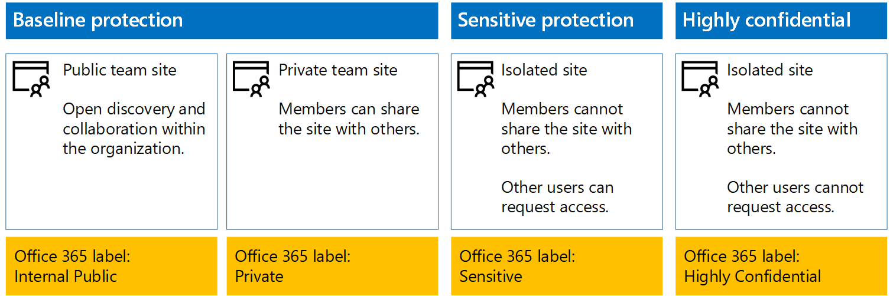
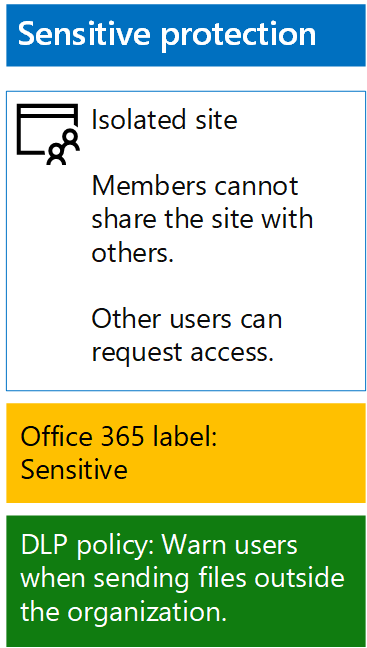
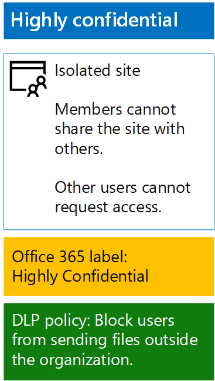

# Protect SharePoint Online files with Office 365 labels and DLP

 **Summary:** Apply Office 365 labels and data loss prevention (DLP) policies for SharePoint Online team sites with various levels of information protection.
  
Use the steps in this article to design and deploy Office 365 labels and DLP policies for baseline, sensitive, and highly confidential SharePoint Online team sites. For more information about these three tiers of protection, see [Secure SharePoint Online sites and files](secure-sharepoint-online-sites-and-files.md).
  
## Office 365 labels for your SharePoint Online sites

There are three phases to creating and then assigning Office 365 labels to SharePoint Online team sites.
  
### Phase 1: Determine the Office 365 label names

In this phase, you determine the names of your Office 365 labels for the four levels of information protection applied to SharePoint Online team sites. The following table lists the recommended names for each level.
  
|**SharePoint Online team site protection level**|**Label name**|
|:-----|:-----|
|Baseline-Public  <br/> |Internal public  <br/> |
|Baseline-Private  <br/> |Private  <br/> |
|Sensitive  <br/> |Sensitive  <br/> |
|Highly Confidential  <br/> |Highly Confidential  <br/> |
   
### Phase 2: Create the Office 365 labels

In this phase, you create and then publish your determined labels for the different levels of information protection.
  
To create the labels, you can use the Office 365 Admin center or Microsoft PowerShell.
  
### Create Office 365 labels with the Office 365 Admin center

1. Sign in to the Office 365 portal with an account that has the Security Administrator or Company Administrator role. For help, see [Where to sign in to Office 365](https://support.office.com/Article/Where-to-sign-in-to-Office-365-e9eb7d51-5430-4929-91ab-6157c5a050b4).
    
2. From the **Microsoft Office Home** tab, click the **Admin** tile.
    
3. From the new **Office Admin center** tab of your browser, click **Admin centers > Security &amp; Compliance**.
    
4. From the new **Home - Security &amp; Compliance** tab of your browser, click **Classifications > Labels**.
    
5. From the **Home > Labels** pane, click **Create a label**.
    
6. On the **Name your label** pane, type the name of the label, and then click **Next**.
    
7. On the **Label settings** pane, click **Next**.
    
8. On the **Review your settings** pane, click **Create this label**, and then click **Close**.
    
9. Repeat steps 5-8 for your additional labels.
    
### Create Office 365 labels with PowerShell

1. [Connect to the Office 365 Security &amp; Compliance Center using remote PowerShell](http://go.microsoft.com/fwlink/?LinkID=799771&amp;clcid=0x409) and specify the credentials of an account that has the Security Administrator or Company Administrator role.
    
2. Fill out the list of label names, and then run these commands at the PowerShell command prompt:
    
  ```
  $labelNames=@(<list of label names, each enclosed in quotes and separated by commas>)
ForEach ($element in $labelNames){ New-ComplianceTag -Name $element }
  ```

Next, use these steps to publish the new Office 365 labels.
  
1. From the **Home > Labels** pane the Security &amp; Compliance Center, click **Publish labels**.
    
2. On the **Choose labels to publish** pane, click **Choose labels to publish**.
    
3. On the **Choose labels** pane, click **Add** and select all four labels.
    
4. Click **Done**.
    
5. On the **Choose labels to publish** pane, click **Next**.
    
6. On the **Choose locations** pane, click **Next**.
    
7. On the **Name your policy** pane, type a name for your set of labels in **Name**, and then click **Next**.
    
8. On the **Review your settings** pane, click **Publish labels**, and then click **Close**.
    
### Phase 3: Apply the Office 365 labels to your SharePoint Online sites

Use these steps to apply the Office 365 labels to the documents folders of your SharePoint Online team sites.
  
1. From the **Microsoft Office Home** tab of your browser, click the **SharePoint** tile.
    
2. On the new **SharePoint** tab in your browser, click a site that needs an Office 365 label assigned.
    
3. In the new SharePoint site tab of your browser, click **Documents**.
    
4. Click the settings icon, and then click **Library settings**.
    
5. Under **Permissions and Management**, click **Apply label to items in this library**.
    
6. In **Settings-Apply Label**, select the appropriate label, and then click **Save**.
    
7. Close the tab for the SharePoint Online site.
    
8. Repeat steps 3-8 to assign Office 365 labels to your additional SharePoint Online sites.
    
Here is your resulting configuration.
  

  
## DLP policies for your SharePoint Online sites

Use these steps to configure a DLP policy that notifies users when they share a document on a SharePoint Online sensitive team site outside the organization.
  
1. From the **Microsoft Office Home** tab in your browser, click the **Security &amp; Compliance** tile.
    
2. On the new **Security &amp; Compliance** tab in your browser, click **Data loss prevention > Policy**.
    
3. In the **Data loss prevention** pane, click **+ Create a policy**.
    
4. In the **Start with a template or create a custom policy** pane, click **Custom**, and then click **Next**.
    
5. In the **Name your policy** pane, type the name for the sensitive level DLP policy in **Name**, and then click **Next**.
    
6. In the **Choose locations** pane, click **Let me choose specific locations**, and then click **Next**.
    
7. In the list of locations, disable the **Exchange email** and **OneDrive accounts** locations, and then click **Next**.
    
8. In the **Customize the types of sensitive info you want to protect** pane, click **Edit**.
    
9. In the **Choose the types of content to protect** pane, click **Add** in the drop-down box, and then click **Labels**.
    
10. In the **Labels** pane, click **+ Add**, select the **Sensitive** label, click **Add**, and then click **Done**.
    
11. In the **Choose the types of content to protect** pane, click **Save**.
    
12. In the **Customize the types of sensitive info you want to protect** pane, click **Next**.
    
13. In the **What do you want to do if we detect sensitive info?** pane, click **Customize the tip and email**.
    
14. In the **Customize policy tips and email notifications** pane, click **Customize the policy tip text**.
    
15. In the text box, type or paste in the following:
    
  - To share with a user outside the organization, download the file and then open it. Click File, then Protect Document, and then Encrypt with Password, and then specify a strong password. Send the password in a separate email or other means of communication.
    
    Alternately, type or paste in your own policy tip that instructs users on how to share a file outside your organization.
    
16. Click **OK**.
    
17. In the **What do you want to do if we detect sensitive info?** pane, clear the **Block people from sharing, and restrict access to shared content** check box, and then click **Next**.
    
18. In the **Do you want to turn on the policy or test things out first?** pane, click **Yes, turn it on right away**, and then click **Next**.
    
19. In the **Review your settings** pane, click **Create**, and then click **Close**.
    
Here is your resulting configuration for sensitive SharePoint Online team sites.
  

  
Next, use these steps to configure a DLP policy that blocks users when they share a document on a SharePoint Online highly confidential team site outside the organization.
  
1. From the **Microsoft Office Home** tab in your browser, click the **Security &amp; Compliance** tile.
    
2. On the new **Security &amp; Compliance** tab in your browser, click **Data loss prevention > Policy**.
    
3. In the **Data loss prevention** pane, click **+ Create a policy**.
    
4. In the **Start with a template or create a custom policy** pane, click **Custom**, and then click **Next**.
    
5. In the **Name your policy** pane, type the name for the highly sensitive level DLP policy in **Name**, and then click **Next**.
    
6. In the **Choose locations** pane, click **Let me choose specific locations**, and then click **Next**.
    
7. In the list of locations, disable the **Exchange email** and **OneDrive accounts** locations, and then click **Next**.
    
8. In the **Customize the types of sensitive info you want to protect** pane, click **Edit**.
    
9. In the **Choose the types of content to protect** pane, click **Add** in the drop-down box, and then click **Labels**.
    
10. In the **Labels** pane, click **+ Add**, select the **Highly Confidential** label, click **Add**, and then click **Done**.
    
11. In the **Choose the types of content to protect** pane, click **Save**.
    
12. In the **Customize the types of sensitive info you want to protect** pane, click **Next**.
    
13. In the **What do you want to do if we detect sensitive info?** pane, click **Customize the tip and email**.
    
14. In the **Customize policy tips and email notifications** pane, click **Customize the policy tip text**.
    
15. In the text box, type or paste in the following:
    
  - To share with a user outside the organization, download the file and then open it. Click File, then Protect Document, and then Encrypt with Password, and then specify a strong password. Send the password in a separate email or other means of communication.
    
    Alternately, type or paste in your own policy tip that instructs users on how to share a file outside your organization.
    
16. Click **OK**.
    
17. In the **What do you want to do if we detect sensitive info?** pane, select **Require a business justification to override**, and then click **Next**.
    
18. In the **Do you want to turn on the policy or test things out first?** pane, click **Yes, turn it on right away**, and then click **Next**.
    
19. In the **Review your settings** pane, click **Create**, and then click **Close**.
    
Here is your resulting configuration for high confidentiality SharePoint Online team sites.
  

  
## Next step

[Protect SharePoint Online files with Azure Information Protection](protect-sharepoint-online-files-with-azure-information-protection.md)
    
## See Also

[Secure SharePoint Online sites and files](secure-sharepoint-online-sites-and-files.md)
  
[Secure SharePoint Online sites in a dev/test environment](secure-sharepoint-online-sites-in-a-dev-test-environment.md)
  
[Microsoft Security Guidance for Political Campaigns, Nonprofits, and Other Agile Organizations](microsoft-security-guidance-for-political-campaigns-nonprofits-and-other-agile-o.md)
  
[Cloud adoption and hybrid solutions](cloud-adoption-and-hybrid-solutions.md)


