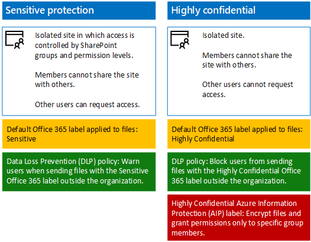

# Secure SharePoint Online team sites for sensitive and highly confidential assets

 **Summary:** How Contoso implemented sensitive protection and highly confidential SharePoint Online team sites for easier, yet secure, collaboration for executives and its research centers.
  
The executive leadership of Contoso want to use Office 365 and store their files in a single location for collaboration, regardless of where an executive might be. Similarly, Contoso's research departments—with divisions in Paris, Moscow, New York, Beijing, and Bangalore—would like to transition their on-premises digital assets to the cloud for easier access and more open collaboration across teams.
  
However, in both of these cases, access to these resources must be restricted to the subset of people who are allowed to view or change them, with ongoing permissions for the site administered by IT staff. Additionally, even if some resources are intentionally or unintentionally distributed, they must be encrypted and have permissions to prevent those who do not have access to view or change their contents.
  
Security and SharePoint administrators in Contoso's IT department decided to use sensitive protection and highly-confidential SharePoint Online team sites, as shown in Figure 1.
  
**Figure 1: Comparison of sensitive protection and highly confidential SharePoint Online team sites**

  
Contoso used these steps to create secure SharePoint Online team sites for their executives and research teams:
  
1. Create an **Executives** sensitive SharePoint Online team site
    
    The new team site uses existing Azure Active Directory (AD) groups for executives as members with the Edit SharePoint permission level and a small set of SharePoint administrator accounts as owners with the Full Control permission level.
    
2. Migrate executives files
    
    Move existing on-premises executive files and folders to the new Executives SharePoint Online team site.
    
3. Create a **Research** highly confidential SharePoint Online team site
    
    The new team site uses existing Azure AD research team groups as members with the Edit permission level and a small set of SharePoint administrator accounts as owners with the Full Control permission level. An AIP label assigned to research files ensures that they are encrypted and only members of a research group can open them.
    
4. Migrate research files
    
    Move existing research team on-premises files and folders to the new Research SharePoint Online team site.
    
The result is two collaboration sites whose access is tightly controlled by security and SharePoint administrators. For files with the Highly Confidential AIP label, even if they are distributed outside the Research team site, they are encrypted and can only be opened by a member of a research team.
  
For more information, see [Secure SharePoint Online sites and files](https://docs.microsoft.com/microsoft-365-enterprise/secure-sharepoint-online-sites-and-files).
  
 To set this up for demonstration, proof-of-concept, or dev/test, see [Secure SharePoint Online sites in a dev/test environment](https://docs.microsoft.com/microsoft-365-enterprise/secure-sharepoint-online-sites-dev-test).
  
## See Also

#### 

[Enterprise scenarios for the Contoso Corporation](enterprise-scenarios-for-the-contoso-corporation.md)
  
[Contoso in the Microsoft Cloud](contoso-in-the-microsoft-cloud.md)
  
[Microsoft Cloud IT architecture resources](microsoft-cloud-it-architecture-resources.md)
#### 

[Stretch Database](https://msdn.microsoft.com/library/dn935011.aspx)
  
[Microsoft's Enterprise Cloud Roadmap: Resources for IT Decision Makers](https://sway.com/FJ2xsyWtkJc2taRD)

