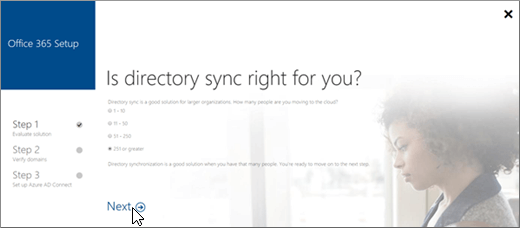
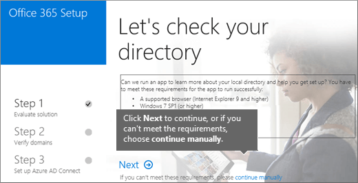
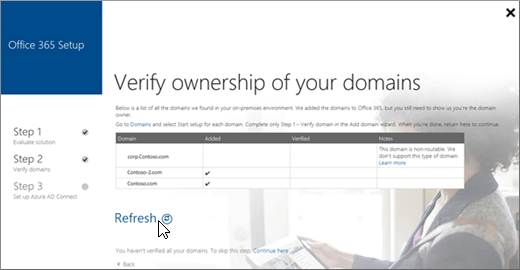

# Set up directory synchronization for Office 365
Office 365 uses the cloud-based user identity management service Azure Active Directory to manage users. You can also integrate your on-premises Active Directory with Azure AD by synchronizing your on-premises environment with Office 365. Once you set up synchronization you can decide to have their user authentication take place within Azure AD or within your on-premises directory.
  
## Office 365 directory synchronization
You can either use synchronized identity or federated identity between your on-premises organization and Office 365. With synchronized identity, you manage your users on-premises, and they are authenticated by Azure AD when they use the same password in the cloud as on-premises. This is the most common directory synchronization scenario. Pass-through authentication or Federated identity, allows you to manage your users on-premises and they are authenticated by your on-premises directory. Federated identity requires additional configuration and enables your users to only sign in once. For details, read [Understanding Office 365 Identity and Azure Active Directory](about-office-365-identity.md).
  
## Want to upgrade from Windows Azure Active Directory sync (DirSync) to Azure Active Directory Connect?
If you are currently using DirSync and want to upgrade, head over to [azure.com](https://azure.com) for [upgrade instructions](https://go.microsoft.com/fwlink/p/?LinkId=733240).
  
## Prerequisites for Azure AD Connect
You get a free subscription to Azure AD with your Office 365 subscription. When you set up directory synchronization, you will install Azure Active Directory Connect on one of your on-premises servers.
  
For Office 365 you will need to:
  
- Verify your on-premises domain (the procedure will guide you through this).
- Have [Assign admin roles in Office 365 for business](https://support.office.com/article/EAC4D046-1AFD-4F1A-85FC-8219C79E1504) permissions for your Office 365 tenant and on-premises Active Directory. 
    
For your on-premises server on which you install Azure AD Connect you will need the following software:
  
|**Server OS**|**Other software**|
|:-----|:-----|
|**Windows Server 2012 R2** | - PowerShell is installed by default, no action is required.    - Net 4.5.1 and later releases are offered through Windows Update. Make sure you have installed the latest updates to Windows Server in the Control Panel. |
|**Windows Server 2008 R2 with Service Pack 1 (SP1)** or **Windows Server 2012** | - The latest version of PowerShell is available in Windows Management Framework 4.0. Search for it on [Microsoft Download Center](https://go.microsoft.com/fwlink/p/?LinkId=717996).    - .Net 4.5.1 and later releases are available on [Microsoft Download Center](https://go.microsoft.com/fwlink/p/?LinkId=717996). |
|**Windows Server 2008** | - The latest supported version of PowerShell is available in Windows Management Framework 3.0, available on [Microsoft Download Center](https://go.microsoft.com/fwlink/p/?LinkId=717996).    - .Net 4.5.1 and later releases are available on [Microsoft Download Center](https://go.microsoft.com/fwlink/p/?LinkId=717996). |
   
> [!NOTE]
> If you're using Azure Active Directory DirSync, the maximum number of distribution group members that you can synchronize from your on-premises Active Directory to Azure Active Directory is 15,000. For Azure AD Connect, that number is 50,000. 
  
To more carefully review hardware, software, account and permissions requirements, SSL certificate requirements, and object limits for Azure AD Connect, read [Prerequisites for Azure Active Directory Connect](https://go.microsoft.com/fwlink/p/?LinkId=716896).
  
You can also review the Azure AD Connect [version release history](https://go.microsoft.com/fwlink/p/?LinkId=733238) to see what is included and fixed in each release. 

## To set up directory synchronization
1. Sign in to the Office 365 admin center and choose **Users** \> **Active Users** on the left navigation. 
2. In the Office 365 admin center, on the **Active users** page, choose ** More ** \> **Directory synchronization**.
    
    
  
3. On the ** Is directory sync right for you? ** page, the two first choices of **1-10**, and **11-50** result in "Based on the size of your organization, we recommend that you create and manage users in the cloud. Using directory synchronization will make your setup more complex. Go to Active users to add your users." 
    
    - You can still, however, continue setting up directory synchronization by choosing **Continue here** on the bottom of the page. 
    
    - If you select the two latter choices, **51-250** or **251 or greater**, the synchronization setup will recommend directory synchronization. Choose **Next** to continue. 
    
    
  
4. On the **Sync your local directory with the cloud**, read the information, and if you want more information, choose the learn more link that goes to: [Prepare to provision users through directory synchronization to Office 365](prepare-for-directory-synchronization.md), and then choose **Next**. 
    
5. On the **Let's check your directory** page, review the requirements for automatically checking your directory. If you meet the requirements, choose **Next** \> **Start scan**. If you can't meet the requirements you can still continue by choosing **continue manually**.
    
    
  
6. If you select to scan your directories, choose **Start scan** on the **Evaluating directory synchronization setup** page. 
    
    Follow the instructions to download and run the scan.
    
7. Once the scan is complete, return to the setup wizard, and choose **Next** to see your scan results. 
    
8. Verify your domains as instructed on the **Verify Ownership of your domains** page. For detailed instructions, see [Create DNS records for Office 365 when you manage your DNS records](https://support.office.com/article/b0f3fdca-8a80-4e8e-9ef3-61e8a2a9ab23).
    
    > [!IMPORTANT]
    > After you have added a TXT record to verify you own your domain, do not go to the next step of adding users in the domains wizard. The directory synchronization will add users for you. 
  
    Return to the **Office 365 Setup** page and choose **Refresh**
    
    
  
9. On the **Your domains are ready** page, choose **Next**.
    
10. On the **Clean up your environment** page, optionally follow the instructions to download IDFix to check your Active Directory. Choose **Next** to continue. 
    
11. On the ** Run Azure Active Directory Connect ** page, choose **Download** to install Azure AD Connect wizard. 
    
    > [!NOTE]
    > At this point you will be in the Azure AD Connect wizard. Make sure you leave the directory synchronization wizard page you were last on open in your browser, so you can return to it after the Azure AD Connect steps are done. 
  
    After Azure AD Connect wizard has installed it will automatically open. You can also open it from your desktop, the default install site. Follow the wizard instructions depending on your scenario:
    
  - For directory synchronization with password hash synchronization, use [Azure AD Connect with express settings](https://go.microsoft.com/fwlink/p/?LinkID=698537).
    
  - For multiple forests, pass-through authentication, federated identity and SSO options, use [Custom Installation of Azure AD Connect](https://go.microsoft.com/fwlink/p/?LinkId=698430).
    
    Select **Customize** on the **Express Settings** page to use these options. 
    
12. After the Azure AD Connect wizard is done, return to the **Office 365 Setup** wizard, and follow the instructions on the **Make sure sync worked as expected page**. Choose **Next** to continue. 
    
13. Read the instructions on the ** Activate users ** page and then choose **Next**.
    
14. Choose **Finish** on the **You're all setup** page. 
    
## Assign licences to synchronized users
After you have synchronized your users to Office 365, they are created but you need to assign licenses to them so they can use Office 365 features, such as mail. For instructions, see [Assign licenses to users in Office 365 for business](https://support.office.com/article/997596b5-4173-4627-b915-36abac6786dc).
    
## Finish setting up domains
Follow the steps in [Create DNS records for Office 365 when you manage your DNS records](https://support.office.com/article/b0f3fdca-8a80-4e8e-9ef3-61e8a2a9ab23) to finish setting up your domains.