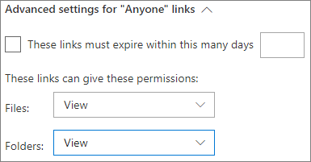

---
title: "Limit accidental exposure"
ms.author: mikeplum
author: MikePlumleyMSFT
manager: pamgreen
audience: ITPro
ms.topic: article
ms.service: sharepoint-online
localization_priority: Priority
description: "Learn how to limit accidental exposure of information when sharing files with guests."
---

# Limit accidental exposure to files when sharing with guests

When sharing files and folders with guests, there are a variety of options to reduce the chances of accidentally sharing confidential information. You can choose from the options in this article to best meet the needs of your organization.

## Set Anyone link permissions to View

If people in your organization need to do anonymous sharing, but you're concerned about unauthenticated guests modifying content, you can set the permissions for Anyone links to View. This will prevent unauthenticated users from modifying content in your organization.

To set the default Anyone link permissions
1. In the SharePoint admin center, in the left navigation, click **Sharing**.
2. Under **Advanced settings for Anyone links**, select **View** for **Files** and **Folders**. 
   
3. Click **Save**.

## Set default link type to only work for people in your organization

If you have *Anyone* sharing enabled for your organization, the default sharing link is normally set to Anyone. While this can be convenient if you have users who do a lot of anonymous sharing, it can increase the risk of unintentional anonymous sharing. If a user forgets to change the link type while sharing a sensitive document, they might accidentally create a sharing link that doesn't require authentication.

An easy way to mitigate this risk, while still allowing anonymous sharing for those who need it, is to change the default link setting to a link that only works for people inside your organization. Users who want to share anonymously would then have to specifically select that option.

To set the default file and folder sharing link
1. In the SharePoint admin center, in the left navigation, click **Sharing**.
2. Under **File and folder links**, select **Only people in your organization**. 
   
3. Click **Save**

## Turn off Anyone links

If you always want guests to authenticate when accessing content in SharePoint, Groups, or Teams, you can turn off *Anyone* sharing. This will prevent users from sharing content anonymously.

If you disable *Anyone* links, users can still easily share with guests using Specific people links. In this case, all guests will be required to authenticate before they can access the shared content.

Depending on your needs, you can disable *Anyone* links for specific sites, or for your whole organization.

To turn off *Anyone* links for your organization
1. In the SharePoint admin center, in the left navigation, click **Sharing**.
2. Set the SharePoint external sharing settings to **New and existing guests**. 
   
3. Click **Save**.

To turn off *Anyone* links for a site
1. In the SharePoint admin center, in the left navigation, expand **Sites** and click **Active sites**.
2. Select the site for the team that you just created.
3. In the ribbon, click **Sharing**.
4. Ensure that sharing is set to **Anyone** or **New and existing guests**. 
   
5. If you made changes, click **Save**.

## Domain filtering

You can use domain allow or deny lists to determine which domains your users can invite guests from.

With an allow list, you can specify a list of domains from which users in your organization can invite guests. Guest invitations to other domains are blocked. If your organization only collaborates with guests from a list of specific domains, you can use this feature to prevent sharing with other domains.

With a deny list, you can specify a list of domains from which users in your organization cannot invite guests. Guest invitations to the listed domains are blocked. This can be useful if you have competitors, for example, who you want to prevent from becoming guests in your organization.

The allow and deny lists only affect sharing with authenticated guests. Users can still share with guests from prohibited domains by using *Anyone* links if you haven't disabled them. For best results with domain allow and deny lists, consider disabling *Anyone* links as described above.

To set up a domain allow or deny list for guest sharing
1. In the SharePoint admin center, in the left navigation, click **Sharing**.
2. Under **Advanced settings for external sharing**, select the **Limit external sharing by domain** check box.
3. Click **Add domains**.
4. Select whether you want to block domains, type the domains, and click **OK**. 
   
5. Click **Save**.

## Limit guest sharing of files, folders, and sites to specified security groups

You can restrict guest sharing of files, folders, and sites to members of a specific security group. This is useful if you want to enable guest sharing, but with an approval workflow or request process.

To limit guest sharing to members of a security group
1. In the SharePoint admin center, in the left navigation, click **Sharing**.
2. Under **Other settings**. follow the **Limit external sharing to specific security groups** link.
3. Under **Who can share outside your organization**, select one or both of the check boxes:
    a. **Let only users in selected security groups share with authenticated external users** to specify a security group that can share with authenticated users
    b. **Let only users in selected security groups share with authenticated external users and using anonymous links** to specify a security group that can share with authenticated users and by using Anyone links
4. Click **OK**.

Note that this affects files, folders, and sites, but not Office 365 groups or Teams. When members invite guests to a private Office 365 group or a private team in Microsoft Teams, the invitation is sent to the group or team owner for approval.

## See Also

[Create a secure guest sharing environment](create-a-secure-guest-sharing-environment.md)

[Best practices for sharing files and folders with anonymous users](best-practices-anonymous-sharing.md)