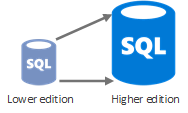
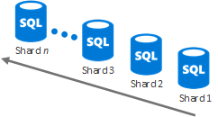
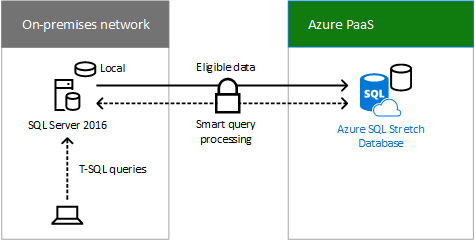
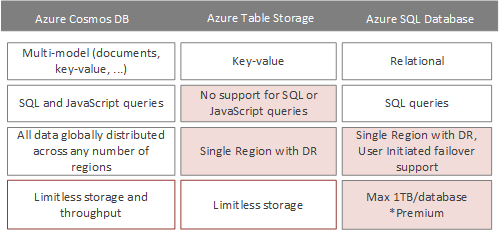

# Some assembly required

 **Summary:** Get the details on the set of cloud storage options that you can use to create your custom storage solution.
  
"Some assembly required " storage solutions:
  
- Use existing services as a starting point for your storage solution.
    
- Require some configuration or coding.
    
- Can be customized to fit your needs.
    
The following sections describe the details of each "Some assembly required" storage solution.
  
## Azure Content Delivery Network

### Features

- Advanced and real time analytics
    
- Robust security against DDoS
    
- Gets content automatically from an Azure Website or Azure Cloud Service once you set up the integration
    
- New partnership with Akamai
    
- Can handle sudden traffic spikes and heavy loads
    
### Common uses

- Distribute audio, video, applications, images, and other files faster and more reliably to customers by using the servers that are closest to them
    
### Key storage scenarios

- Manage data
    
- Manage videos
    
### Resources

For additional information, click [here](https://azure.microsoft.com/services/cdn/).
  
For cost information, click [here](https://azure.microsoft.com/pricing/details/cdn/).
  
## HdInsight

### Features

- Apache Hadoop distribution powered by the cloud A Data Lake service
    
- Scale to petabytes on demand
    
- Process unstructured and semi-structured data Develop in Java, .NET, and more
    
- Skip buying and maintaining hardware
    
- Connect on-premises Hadoop clusters with the cloud
    
- Flexibility to deploy arbitrary Hadoop projects through custom scripts (e.g. R, Giraph, Solr)
    
### Common uses

- Data analytics workloads
    
- In-memory data processing framework for big data (Spark)
    
- Real-time stream processing (Storm)
    
- Large transactional processing (OLTP) of non-relational data (HBase)
    
### Key storage scenarios

- Manage data
    
### Resources

For additional information, click [here](https://azure.microsoft.com/services/hdinsight/).
  
For cost information, click [here](https://azure.microsoft.com/pricing/details/hdinsight/).
  
## Azure SQL Database

### Features

- Optimized to reduce management and costs
    
- Automatic high availability, disaster recovery, and upgrade
    
- Recommended for organizations managing hundreds or thousands of databases of up to 1 TB in size
    
- Sharding techniques can split data across databases for increased storage
    
- Stretch database with SQL Server 2016
    
### Common uses

- New cloud-designed applications with relational data
    
- Data processing over schematic, highly structured data sets with relationships
    
- Spatial data or rich data types
    
### Key storage scenarios

- Manage data
    
### Elastic database

Use the virtually unlimited resources of Azure SQL Database when:
  
- The total amount of data is too large to fit within the constraints of a single database.
    
- The transaction throughput of the overall workload exceeds the capabilities of a single database.
    
- Tenants require physical isolation from each other, so separate databases are needed for each tenant.
    
- Different sections of a database need to reside in different geographies for compliance, performance, or geopolitical reasons.
    
With vertical scaling, you can change Azure database performance level/edition or by using elastic database pools.
  

  
With horizontal scaling, you can add new databases as needed.
  

  
Click [here](https://docs.microsoft.com/azure/sql-database/sql-database-elastic-scale-introduction) for more information.
  
### Stretch Database with SQL Server 2016

Stretch database is a feature of SQL Server 2016 that allows you to transparently and securely move cold data, such as closed business data in a large table that contains customer order information, to a SQL Stretch database in Azure. When stretched, the contents of a SQL Server instance, a database, or even a single table is the combination of local data in SQL Server 2016 server and remote data in Azure. Data that becomes eligible for stretch is automatically moved to Azure by SQL Server 2016.
  

  
User queries that include the historical data are transparently forwarded to Azure SQL Stretch database. The queries do not need to be re-written, even though the table is stretched.
  
Stretch database provides a cost-effective option for long-term storage and transparent access to historical data. It also solves performance and availability problems that arise when tables become very large.
  
Click [here](https://msdn.microsoft.com/library/dn935011.aspx) for more information.
  
### Resources

For additional information, click [here](http://azure.microsoft.com/services/sql-database/).
  
For cost information, click [here](http://azure.microsoft.com/pricing/details/sql-database/).
  
## Azure Cosmos DB

### Features

- Guaranteed low latency, 99.99% availability SLA with limitless, elastic scale of storage and throughput
    
- All data is globally replicated across any number of regions with transparent failover and four well-defined consistency levels
    
- Automatically indexes all your data without requiring schemas or secondary indices
    
- Rich SQL and JavaScript queries and multi-item transactions
    
### Common uses

- IoT, Mobile and Social
    
- Gaming
    
- Retail
    
- Content management
    
### Key storage scenarios

- Manage data
    
### Cosmos DB vs. Azure Tables vs. Azure SQL Database

Common attributes of Cosmos DB, Azure Table Storage, and Azure SQL Database:
  
- 99.99 availability SLA
    
- Fully managed database services
    
- ISO 27001, HIPAA and EU Model Clauses Compliant
    
The following table shows the uncommon attributes of Azure Cosmos DB, Azure Table Storage, and Azure SQL Database.
  

  
### Resources

For additional information, click [here](http://azure.microsoft.com/services/documentdb/).
  
For cost information, click [here](http://azure.microsoft.com/pricing/details/documentdb/).
  
## Azure Media Services

### Features

- Live and video on demand (VOD) delivery with scale
    
- Highly available encoding and streaming
    
- Supports Flash, iOS, Android, HTML5, and Xbox
    
- Studio-certified DRM support
    
- Rich content monetization
    
- Broad ecosystem of pre-integrated partners
    
### Common uses

- Encode, store, and stream audio and video at scale
    
- Real time streaming and VOD
    
- Streamlined video content management
    
### Key storage scenarios

- Manage videos
    
### Resources

For additional information, click [here](https://azure.microsoft.com/services/media-services/).
  
For cost information, click [here](http://azure.microsoft.com/pricing/details/media-services/).
  
## Azure Redis Cache

### Features

- Secure, dedicated Redis server with high-availability with data replication and failover managed by Microsoft
    
- Recommended for any app needing high-throughput
    
- Available in sizes up to 530 GB and beyond (with Premium and automatic sharding)
    
- Redis Persistence persists in-memory cached data to Azure Storage
    
- Redis Clustering allows you to achieve maximum scale and throughput
    
- Enhanced security and network isolation with Azure Virtual Network support
    
### Common uses

- Reverse lookup for data in any storage service in Azure, such as Cosmos DB and Azure SQL Database
    
- Synchronized content from other data stores
    
### Key storage scenarios

- Cache data
    
- Message broker for high-throughput applications
    
### Resources

For additional information, click [here](http://azure.microsoft.com/services/cache/).
  
For cost information, click [here](http://azure.microsoft.com/pricing/details/cache/).
  
## SQL Server on an Azure VM

### Features

- SQL Server running as an installed application on an Azure virtual machine
    
- Use a gallery image with SQL Server installed or bring your own SQL Server license
    
### Common uses

- Manage data for applications
    
### Key storage scenarios

- Manage data
    
- 
    
### Resources

For additional information, click [here](http://azure.microsoft.com/services/virtual-machines/).
  
For cost information, click [here](http://azure.microsoft.com/pricing/details/virtual-machines/).
  
## StorSimple

### Features

- Scalable, enterprise hybrid SAN storage with SSD and HDD in the on-premises hybrid storage array, with cloud storage as an integrated extension of the solution
    
- Inline deduplication, compression, automatic tiering, and encryption unstructured and semi structured data
    
- Automated offsite data protection using cloud snapshots
    
- Highly-efficient, location-independent disaster recovery
    
- Data mobility for enterprise data with StorSimple Virtual Appliance in Azure
    
### Common uses

- Manage data growth related to file shares, archives, and other data repositories
    
- Offsite data protection and disaster recovery for file shares, virtual machines, SQL, and SharePoint (using Remote Blob Storage)
    
- Utilize cloud snapshots to clone data in Azure and increase business agility
    
### Key storage scenarios

- Manage data
    
- Collaborate
    
### Resources

For additional information, click [here](http://azure.microsoft.com/services/storsimple/).
  
For cost information, click [here](http://azure.microsoft.com/pricing/details/storsimple/).
  
## Azure SQL Data Warehouse

### Features

- Elastic data warehouse that scales to petabytes Up to 32 concurrent queries
    
- Manage large volumes of structured data with fast analytics Dynamically grow and shrink compute in seconds
    
- Supports Transparent Data Encryption
    
- Backed up every 8 hours for 7 days
    
### Common uses

- Sales reports
    
- Usage reports
    
- Lots of data
    
### Key storage scenarios

- Manage data
    
### Resources

For additional information, click [here](https://azure.microsoft.com/services/sql-data-warehouse/).
  
For cost information, click [here](https://azure.microsoft.com/pricing/details/sql-data-warehouse/).
  
## Azure Data Lake Store

### Features

- A hyper-scale repository for big data analytics workloads
    
- A Hadoop Distributed File System for the cloud
    
- No fixed limits on file size
    
- No fixed limits on account size
    
- Unstructured and structured data in their native format
    
- Massive throughput to increase analytic performance
    
- High durability, availability, and reliability (99.9% enterprise-grade SLA and 24/7 support)
    
- Azure Active Directory access control
    
### Common uses

- Enterprise-wide repository to store every type of data collected in a single place
    
### Key storage scenarios

- Manage data
    
### Resources

For additional information, click [here](https://azure.microsoft.com/services/data-lake-store/).
  
For cost information, click [here](https://azure.microsoft.com/pricing/details/data-lake-store/).
  
## Next step

Review the [Build from the ground up](build-from-the-ground-up.md) cloud storage options.
  
## See Also

#### 

[Microsoft Cloud Storage for Enterprise Architects](microsoft-cloud-storage-for-enterprise-architects.md)
  
[Microsoft Cloud IT architecture resources](microsoft-cloud-it-architecture-resources.md)

[Microsoft's Enterprise Cloud Roadmap: Resources for IT Decision Makers](https://sway.com/FJ2xsyWtkJc2taRD)

#### 

