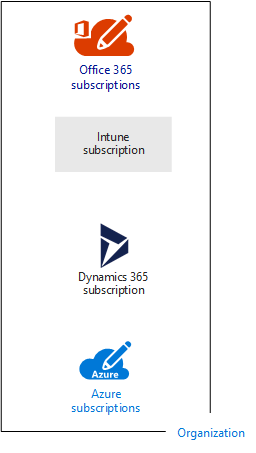
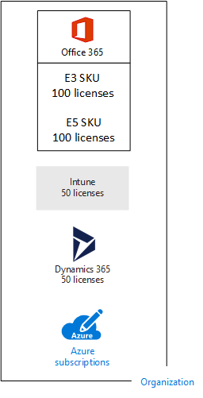
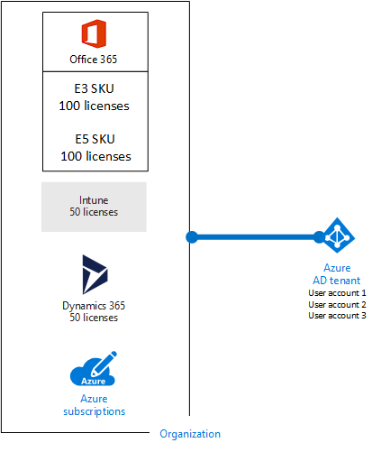
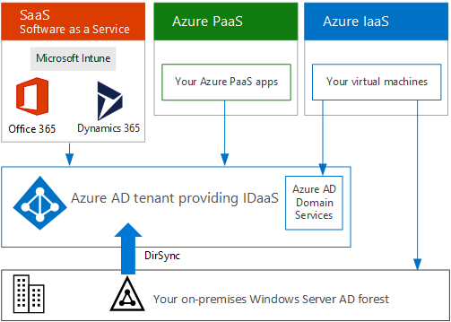

# Subscriptions, licenses, accounts, and tenants for Microsoft's cloud offerings

 **Summary:** Understand the relationships of organizations, subscriptions, licenses, user accounts, and tenants across Microsoft's cloud offerings.
  
Microsoft provides a hierarchy of organizations, subscriptions, licenses, and user accounts for consistent use of identities and billing across its cloud offerings:
  
- Microsoft Office 365
    
    See [business plans and pricing](https://products.office.com/business/compare-office-365-for-business-plans) for more information.
    
- Microsoft Azure
    
    See [Azure pricing](https://azure.microsoft.com/pricing/) for more information.
    
- Microsoft Intune and the Enterprise Mobility + Security (EMS)
    
    See [Intune pricing](https://www.microsoft.com/cloud-platform/microsoft-intune-pricing) for more information.
    
- Microsoft Dynamics 365
    
    See [Dynamics 365 pricing](https://dynamics.microsoft.com/) for more information.
    
## Elements of the hierarchy

Here are the elements of the hierarchy:
  
### Organization

An organization represents a business entity that is using Microsoft cloud offerings, typically identified by one or more public Domain Name System (DNS) domain names, such as contoso.com. The organization is a container for subscriptions.
  
### Subscriptions

A subscription is an agreement with Microsoft to use one or more Microsoft cloud platforms or services, for which charges accrue based on either a per-user license fee or on cloud-based resource consumption. Microsoft's Software as a Service (SaaS)-based cloud offerings (Office 365, Intune/EMS, and Dynamics 365) charge per-user license fees. Microsoft's Platform as a Service (PaaS) and Infrastructure as a Service (IaaS) cloud offerings (Azure) charge based on cloud resource consumption.
  
You can also use a trial subscription, but the subscription expires after a specific amount of time or consumption charges. You can convert a trial subscription to a paid subscription.
  
Organizations can have multiple subscriptions for Microsoft's cloud offerings. Figure 1 shows an example.
  
**Figure 1: Example of multiple subscriptions for an organization**

  
Figure 1 shows a single organization that has multiple Office 365 subscriptions, an Intune subscription, a Dynamics 365 subscription, and multiple Azure subscriptions.
  
### Licenses

For Microsoft's SaaS cloud offerings, a license allows a specific user account to use the services of the cloud offering. You are charged a fixed monthly fee as part of your subscription. Administrators assign licenses to individual user accounts in the subscription. For the example in Figure 2, the Contoso Corporation has an Office 365 Enterprise E5 subscription with 100 licenses, which allows to up to 100 individual user accounts to use Enterprise E5 features and services.
  
**Figure 2: Licenses within the SaaS-based subscriptions for an organization**

  
For Azure PaaS-based cloud services, software licenses are built into the service pricing.
  
For Azure IaaS-based virtual machines, additional licenses to use the software or application installed on a virtual machine image might be required. Some virtual machine images have licensed versions of software installed and the cost is included in the per-minute rate for the server. Examples are the virtual machine images for SQL Server 2014 and SQL Server 2016. 
  
Some virtual machine images have trial versions of applications installed and need additional software application licenses for use beyond the trial period. For example, the SharePoint Server 2016 Trial virtual machine image includes a trial version of SharePoint Server 2016 pre-installed. To continue using SharePoint Server 2016 after the trail expiration date, you must purchase a SharePoint Server 2016 license and client licenses from Microsoft. These charges are separate from the Azure subscription and the per-minute rate to run the virtual machine still applies.
  
### User accounts

User accounts for all of Microsoft's cloud offerings are stored in an Azure Active Directory (AD) tenant, which contains user accounts and groups. An Azure AD tenant can be synchronized with your existing Active Directory Domain Services (AD DS) accounts using Azure AD Connect, a Windows server-based service. This is known as directory synchronization (DirSync).
  
Figure 3 shows an example of multiple subscriptions of an organization using a common Azure AD tenant that contains the organization's accounts.
  
**Figure 3: Multiple subscriptions of an organization that use the same Azure AD tenant**

  
### Tenants

For SaaS cloud offerings, the tenant is the regional location that houses the servers providing cloud services. For example, the Contoso Corporation chose the European region to host its Office 365, EMS, and Dynamics 365 tenants for the 15,000 workers in their Paris headquarters.
  
Azure PaaS services and virtual machine-based workloads hosted in Azure IaaS can have tenancy in any Azure datacenter across the world. You specify the Azure datacenter, known as the location, when you create the Azure PaaS app or service or element of an IaaS workload.
  
An Azure AD tenant is a specific instance of Azure AD containing accounts and groups. Paid or trial subscriptions of Office 365, Dynamics 365, or Intune/EMS include a free Azure AD tenant. This Azure AD tenant does not include other Azure services and is not the same as an Azure trial or paid subscription.
  
### Summary of the hierarchy

Here is a quick recap:
  
- An organization can have multiple subscriptions
    
  - A subscription can have multiple licenses
    
  - Licenses can be assigned to individual user accounts
    
  - User accounts are stored in an Azure AD tenant
    
Here is an example of the relationship of organizations, subscriptions, licenses, and user accounts:
  
- An organization identified by its public domain name.
    
  - An Office 365 Enterprise E3 subscription with user licenses.
    
    An Office 365 Enterprise E5 subscription with user licenses.
    
    An EMS subscription with user licenses.
    
    A Dynamics 365 subscription with user licenses.
    
    Multiple Azure subscriptions.
    
  - The organization's user accounts in a common Azure AD tenant.
    
Multiple Microsoft cloud offering subscriptions can use the same Azure AD tenant that acts as a common identity provider. A central Azure AD tenant that contains the synchronized accounts of your on-premises AD DS provides cloud-based Identity as a Service (IDaaS) for your organization. This is shown in Figure 4.
  
**Figure 4: Synchronized on-premises accounts and IDaaS for an organization**

  
Figure 4 shows how a common Azure AD tenant is used by Microsoft's SaaS cloud offerings, Azure PaaS apps, and virtual machines in Azure IaaS that use Azure AD Domain Services. Azure AD Connect synchronizes the on-premises AD DS forest with the Azure AD tenant.
  
For more information about identity integration across Microsoft's cloud offerings, see [Microsoft Cloud Identity for Enterprise Architects](https://aka.ms/cloudarchidentity).
  
## Combining subscriptions for multiple Microsoft cloud offerings

The following table describes how you can combine multiple Microsoft cloud offerings based on already having a subscription for one type of cloud offering (the labels going down the first column) and adding a subscription for a different cloud offering (going across the columns).
  
||**Office 365**|**Azure**|**Intune/EMS**|**Dynamics 365**|
|:-----|:-----|:-----|:-----|:-----|
|**Office 365**   |NA    |You add an Azure subscription to your organization from the Azure portal.    |You add an Intune/EMS subscription to your organization from the Microsoft 365 admin center.    |You add a Dynamics 365 subscription to your organization from the Microsoft 365 admin center.    |
|**Azure**   |You add an Office 365 subscription to your organization.    |NA    |You add an Intune/EMS subscription to your organization.    |You add a Dynamics 365 subscription to your organization.    |
|**Intune/EMS**   |You add an Office 365 subscription to your organization.    |You add an Azure subscription to your organization from the Azure portal.    |NA    |You add a Dynamics 365 subscription to your organization.    |
|**Dynamics 365**   |You add an Office 365 subscription to your organization.    |You add an Azure subscription to your organization from the Azure portal.    |You add an Intune/EMS subscription to your organization.    |NA    |
   
An easy way to add subscriptions to your organization for Microsoft SaaS-based services is through the Office 365 Admin center:
  
1. Sign in to the Microsoft 365 admin center ([https://admin.microsoft.com](https://admin.microsoft.com)) with your global administrator account.
    
2. From the left navigation of the **Admin center** home page, click **Billing**, and then **Purchase services**.
    
3. On the **Purchase services** page, purchase your new subscriptions.
    
The Office 365 Admin center assigns the organization and Azure AD tenant of your Office 365 subscription to the new subscriptions for SaaS-based cloud offerings.
  
To add an Azure subscription with the same organization and Azure AD tenant as your Office 365 subscription:
  
1. Sign in to the Azure portal ([https://portal.azure.com](https://portal.azure.com)) with your Office 365 global administrator account.
    
2. In the left navigation, click **Subscriptions**, and then click **Add**.
    
3. On the **Add subscription** page, select an offer and complete the payment information and agreement.
    
If you purchased Azure and Office 365 subscriptions separately and want to access the Office 365 Azure AD tenant from your Azure subscription, see the instructions in [Associate an Office 365 tenant with an Azure subscription](https://channel9.msdn.com/Series/Microsoft-Azure-Tutorials/Associate-an-Office-365-tenant-with-an-Azure-subscription).
  
## See Also

[Microsoft Cloud IT architecture resources](microsoft-cloud-it-architecture-resources.md)
  
[Cloud adoption Test Lab Guides (TLGs)](cloud-adoption-test-lab-guides-tlgs.md)
  
[Architectural models for SharePoint, Exchange, Skype for Business, and Lync](architectural-models-for-sharepoint-exchange-skype-for-business-and-lync.md)
  
[Hybrid solutions](hybrid-solutions.md)
  
