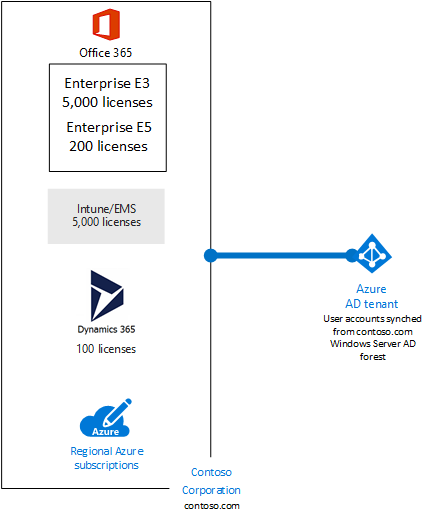
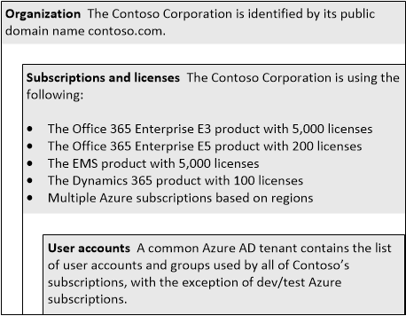

# Subscriptions, licenses, and user accounts for the Contoso Corporation

 **Summary:** Understand the structure of Contoso's cloud subscriptions, licenses, user accounts, and tenants.
  
To provide a consistent use of identities and billing for all cloud offerings, Microsoft provides an organization/subscriptions/licenses/user accounts hierarchy:
  
- Organization
    
    The business entity that is using Microsoft cloud offerings, typically identified by a public DNS domain name, such as contoso.com.
    
- Subscriptions
    
    For Microsoft SaaS cloud offerings (Office 365, Intune/EMS, and Dynamics 365), a subscription is a specific product and a purchased set of user licenses. For Azure, a subscription allows for billing of consumed cloud services to the organization.
    
- Licenses
    
    For Microsoft SaaS cloud offerings, a license allows a specific user account to use cloud services. For Azure, software licenses are built into service pricing, but in some cases you will need to purchase additional software licenses.
    
- User accounts
    
    User accounts are stored in an Azure AD tenant and can be synchronized from an on-premises identity provider such as Windows Server AD.
    
## Contoso's structure

Contoso determined the following structure for the organization and its subscriptions, licenses, accounts, and tenants:
  
**Figure 1: Contoso's organization, subscriptions, licenses, user accounts and tenants**

  
Figure 1 shows how the Contoso organization includes multiple subscriptions and is tied to a common Azure AD tenant that contains the user accounts synchronized from the contoso.com Windows Server AD forest.
  
- **Organization** The Contoso Corporation is identified by its public domain name contoso.com.
    
  - **Subscriptions and licenses** The Contoso Corporation is using the following:
    
  - The Office 365 Enterprise E3 product with 5,000 licenses
    
  - The Office 365 Enterprise E5 product with 200 licenses
    
  - The EMS product with 5,000 licenses
    
  - The Dynamics 365 product with 100 licenses
    
  - Multiple Azure subscriptions based on regions
    
  - **User accounts** A common Azure AD tenant contains the list of user accounts and groups used by all of Contoso's subscriptions, with the exception of dev/test Azure subscriptions.
    
For Contoso's tenants:
  
- For SaaS cloud offerings, the tenant is the regional location that houses the servers providing cloud services. Contoso chose the European region to host its Office 365, EMS, and Dynamics 365 tenants. 
    
- Azure PaaS services and apps and IaaS IT workloads can have tenancy in any Azure datacenter across the world. An Azure AD tenant is a specific instance of Azure AD containing accounts and groups.
    
- The common Azure AD tenant that contains the synchronized accounts for the Contoso Windows Server AD forest provides IDaaS across Microsoft's cloud offerings.
    
For more information, see [Subscriptions, licenses, accounts, and tenants for Microsoft's cloud offerings](subscriptions-licenses-accounts-and-tenants-for-microsoft’s-cloud-offerings.md).
  
## Contoso's Azure subscriptions

Figure 2 shows the hierarchical design of Contoso's Azure subscriptions:
  
**Figure 2: Contoso's structure for Azure subscriptions**

  
- Contoso is at the top, based on its Enterprise Agreement with Microsoft.
    
- There are a set of accounts corresponding to the different regions of the Contoso Corporation around the world, based on the domains of Contoso's Windows Server AD forest.
    
- Within each region, there are one or more subscriptions based on the region's development, testing, and production deployment needs.
    
Each Azure subscription can be associated with a single Azure AD tenant that contains user accounts and groups for authentication and authorization to Azure services. Production subscriptions use the common Contoso Azure AD tenant.
  
## See Also

[Contoso in the Microsoft Cloud](contoso-in-the-microsoft-cloud.md)
  
[Microsoft Cloud IT architecture resources](microsoft-cloud-it-architecture-resources.md)

[Microsoft's Enterprise Cloud Roadmap: Resources for IT Decision Makers](https://sway.com/FJ2xsyWtkJc2taRD)

