# Using Microsoft Azure Active Directory for SharePoint 2013 authentication

 **Summary:** Learn how to use the Azure Access Control Service to authenticate your SharePoint Server 2013 users with Azure Active Directory.
  
It can be easier to manage your users by authenticating them with different identity providers. Consider how convenient it can be to use an identity provider that you trust, but someone else manages. For example, you could have one type of authentication for users who access SharePoint Server 2013 in the cloud and another for SharePoint 2013 users in your on-premises environment. The Azure Access Control Service makes these choices possible. 
  
This article explains how you can use the Azure Access Control Service to authenticate your SharePoint 2013 users with Azure AD, instead of your on-premises Active Directory. In this configuration, Azure AD becomes a trusted identity provider for SharePoint 2013. This configuration adds a user authentication method that is separate from Active Directory authentication used by the SharePoint 2013 installation itself. To benefit from this article, you should be familiar with WS-Federation. For more information, see [Understanding WS-Federation](https://go.microsoft.com/fwlink/p/?linkid=188052).
  
The following figure shows how authentication works for SharePoint 2013 users in this configuration.
  
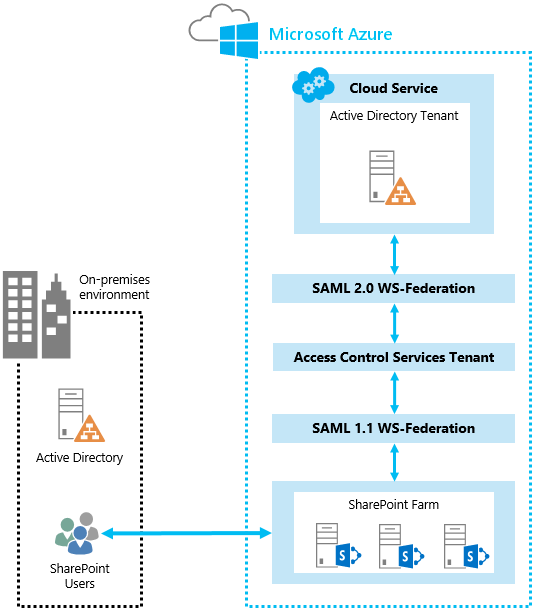
  
The example used in this article is provided by Kirk Evans, Microsoft Architect for the Azure Center of Excellence. 
  
For information about SharePoint 2013 accessibility, see [Accessibility for SharePoint 2013](https://go.microsoft.com/fwlink/p/?LinkId=393123).
  
## Configuration overview

Follow these general steps to set up your environment to use Azure AD as a SharePoint 2013 identity provider.
  
1. Create a new Azure AD tenant and namespace.
    
2. Add a WS-Federation identity provider.
    
3. Add SharePoint as a relying party application.
    
4. Create a self-signed certificate to use for SSL.
    
5. Create a rule group for claims-based authentication.
    
6. Configure the X.509 certificate.
    
7. Create a claim mapping.
    
8. Configure SharePoint for the new identity provider.
    
9. Set the permissions.
    
10. Verify the new provider.
    
## Create Azure AD tenant and namespace

Use the following steps to create a new Azure AD tenant and an associated namespace. In this example, we use the namespace "blueskyabove." 
  
1. In the Azure Management Portal, click **Active Directory**, and then create a new Azure AD tenant.
    
2. Click **Access Control Namespaces**, and create a new namespace. 
    
3. Click **Manage** on the bottom bar. This should open this location, https://blueskyabove.accesscontrol.windows.net/v2/mgmt/web.
    
4. Open Windows PowerShell. Use the Microsoft Online Services Module for Windows PowerShell, which is a prerequisite for installing the Azure for Windows PowerShell cmdlets.
    
5. From the Windows PowerShell command prompt, type the command:  `Connect-Msolservice`, and then type your credentials.
    
    > [!NOTE]
    > For additional information about how to use Azure for Windows PowerShell cmdlets, see [Manage Azure AD using Windows PowerShell](https://go.microsoft.com/fwlink/p/?LinkId=393124). 
  
6. From a Windows PowerShell command prompt, type the following commands:
    
  ```
  Import-Module MSOnlineExtended -Force
  ```

  ```
  $replyUrl = New-MsolServicePrincipalAddresses -Address "https://blueskyabove.accesscontrol.windows.net/"
  ```

  ```
  New-MsolServicePrincipal -ServicePrincipalNames @("https://blueskyabove.accesscontrol.windows.net/") -DisplayName "BlueSkyAbove ACS Namespace" -Addresses $replyUrl
  ```

    The following figure illustrates the output result.
    
     
  
## Add a WS-Federation identity provider to the namespace

Use the following steps to add a new WS-Federation identity provider to the blueskyabove namespace.
  
1. From the Azure management portal, go to **Active Directory** > **Access Control Namespaces**, click **Create a new instance**, and then click **Manage**.
    
2. From the Azure Access Control portal, click **Identity Providers** > **Add**, as illustrated in the following figure.
    
     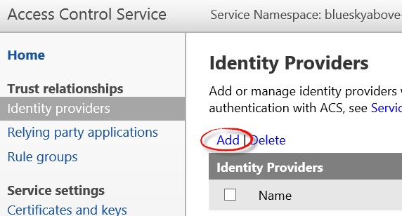
  
3. Click **WS-Federation identity provider**, as illustrated in the following figure, and then click **Next**.
    
     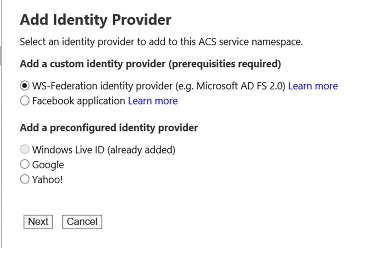
  
4. Fill out the display name and logon link text, and then click **Save**. For the WS-Federation metadata URL, type https://accounts.accesscontrol.windows.net/blueskyabove.onmicrosoft.com/FederationMetadata/2007-06/FederationMetadata.xml. The following figure illustrates the setting.
    
     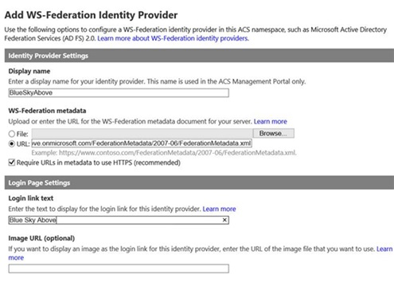
  
## Add SharePoint as a relying party application

Use the following steps to add SharePoint as a relying party application.
  
For additional information about relying party application settings, see [Relying Party Applications](https://go.microsoft.com/fwlink/p/?LinkId=393125).
  
1. From the Azure Access Control portal, click **Relying party applications**, and then click **Add**, as illustrated in the following figure.
    
     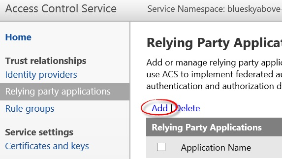
  
## Create a self-signed certificate to use for SSL

Use the following steps to create a new, self-signed certificate to use for secure communications over SSL.
  
1. Extend the web application to use the same URL as PublishingSite, but use SSL with port 443, as illustrated in the following figure.
    
     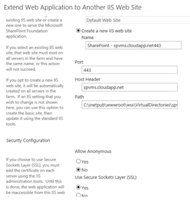
  
2. In IIS Manager, double-click **Server Certificates**.
    
3. In the **Actions** pane, click **Create Self-Signed Certificate**. Type a friendly name for the certificate in the **Specify a friendly name for the certificate** box, and then click **OK**.
    
4. From the **Edit Site Binding** dialog box, ensure the host name is the same as the friendly name, as illustrated in the following figures.
    
     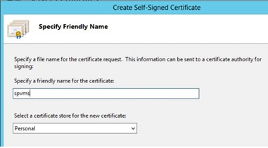
  
     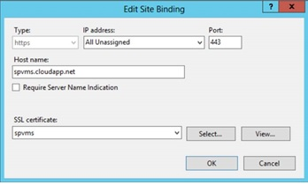
  
5. From the Azure management portal, click the virtual machine that you want to configure, and then click **Endpoints**.
    
6. Click **Add**, and then click **-->** (for Next).
    
7. In **Name**, type a name for the endpoint.
    
8. In **Public Port** and **Private Port**, type the port numbers that you want to use, and then click the check mark to complete. These numbers can be different. For the purposes of this article, we are using 443, as illustrated in the following figure.
    
     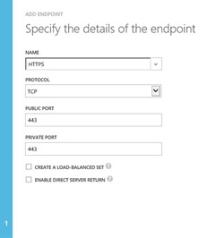
  
    > [!NOTE]
    > For additional information about how to add an endpoint to a virtual machine in Azure, see [How to Set Up Endpoints to a Virtual Machine](https://go.microsoft.com/fwlink/p/?LinkId=393126). 
  
9. From the Access Control services portal, add a relying party, as illustrated in the following figure.
    
     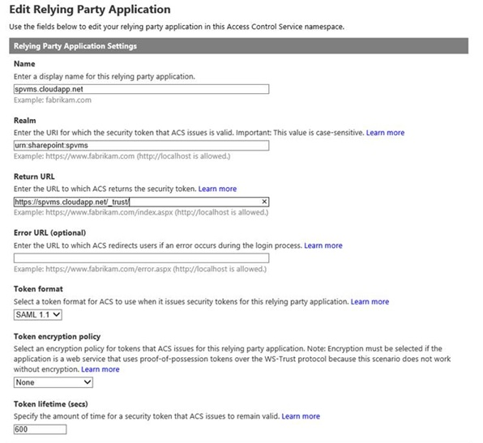
  
## Create a rule group for claims-based authentication

Use the following steps to create a new rule group to control claims-based authentication.
  
1. In the left pane, click **Rule groups**, and then click **Add**.
    
2. Type a name for the rule group, click **Save**, and then click **Generate**. For the purposes of this article, we are using **Default Rule Group for. spvms.cloudapp.net**, as illustrated in the following figure.
    
     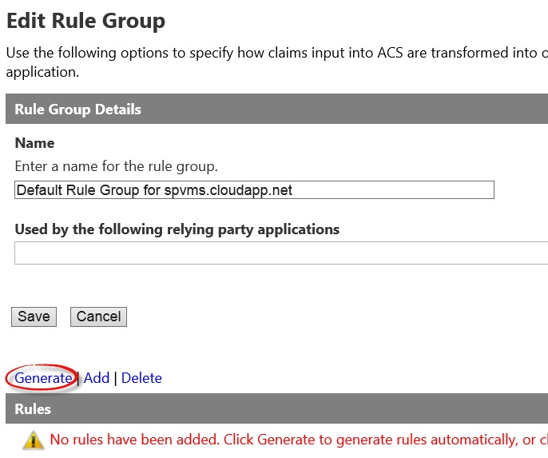
  
     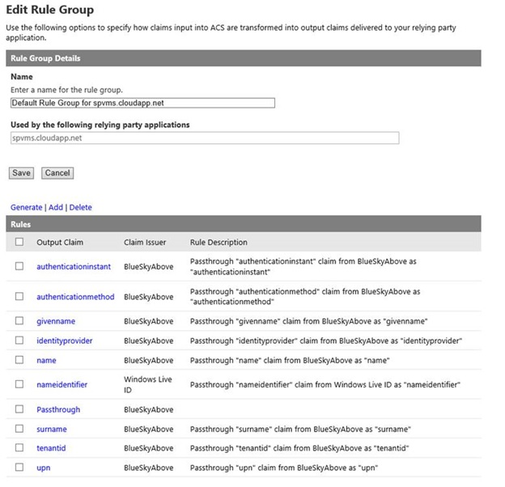
  
    > [!NOTE]
    > For additional information about how to create rule groups, see [Rule Groups and Rules](https://go.microsoft.com/fwlink/p/?LinkId=393128). 
  
3. Click the rule group that you want to change, and then click the claim rule that you want to change. For the purposes of this article, we add a claim rule to the group to pass **name** as **upn**, as illustrated by the following figure.
    
     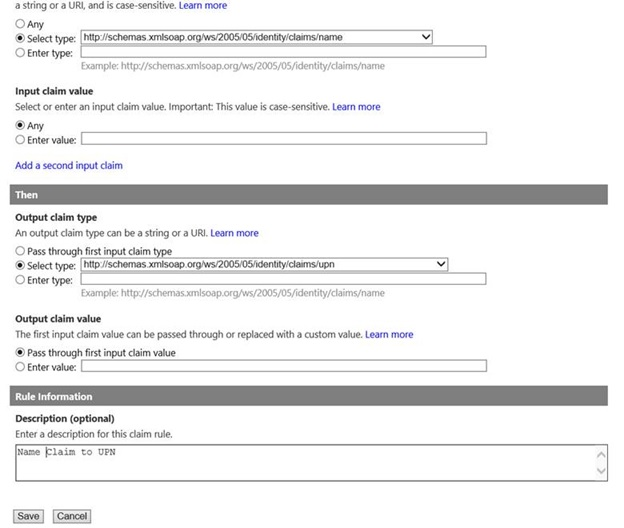
  
4. Delete the existing claim rule named **upn**, and leave the **Name Claim to UPN** rule, as illustrated by the following figure.
    
     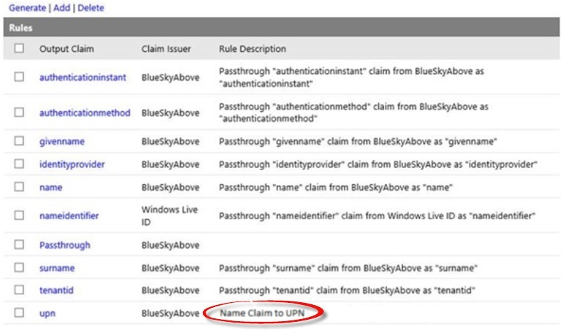
  
## Configure the X.509 certificate

Use the following steps to configure the X.509 certificate to use for token signing.
  
1. In the Access Control Service pane, under **Development**, click **Application integration**.
    
2. In **Endpoint Reference**, locate the **Federation.xml** that is associated with your Azure tenant, and then copy the location in the address bar of a browser.
    
3. In the **Federation.xml** file, locate the **RoleDescriptor** section, and copy the information from the _<X509Certificate>_ element, as illustrated in the following figure.
    
     
  
4. From the root of drive C:\\, create a folder named **Certificates**.
    
5. Save the X509Certificate information to the folder C:\\Certificates with the file name, **AcsTokenSigning.cer**.
    
    > [!NOTE]
    > The file name must be saved with a .cer extension. 
  
     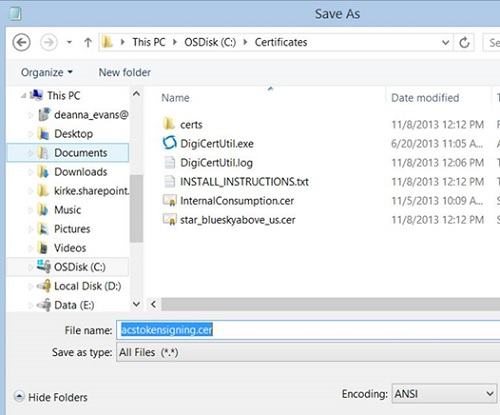
  
## Create a claim mapping by using Windows PowerShell

Use the following steps to create a claim mapping by using Windows PowerShell.
  
Verify that you have the following memberships:
  
1. **securityadmin** fixed server role on the SQL Server instance.
    
2. **db_owner** fixed database role on all databases that will be updated.
    
3. Administrators group on the server on which you are running the Windows PowerShell cmdlets.
    
An administrator can use the **Add-SPShellAdmin** cmdlet to grant permissions to use SharePoint 2013 cmdlets.
  
> [!NOTE]
> If you do not have permissions, contact your Setup administrator or SQL Server administrator to request permissions. For additional information about Windows PowerShell permissions, see [Add-SPShellAdmin](http://technet.microsoft.com/library/2ddfad84-7ca8-409e-878b-d09cb35ed4aa.aspx). 
  
1. From the **Start** menu, click **All Programs**.
    
2. Click **Microsoft SharePoint 2013 Products**.
    
3. Click **SharePoint 2013 Management Shell**.
    
4. At the Windows PowerShell command prompt, type the following commands to create a claim mapping:
    
  ```
  $cert = New-Object System.Security.Cryptography.X509Certificates.X509Certificate2("c:\\certificates\\AcsTokenSigning.cer")
  ```

  ```
  New-SPTrustedRootAuthority -Name "ACS BlueSkyAbove Token Signing" -Certificate $cert
  ```

  ```
  $map = New-SPClaimTypeMapping -IncomingClaimType "http://schemas.xmlsoap.org/ws/2005/05/identity/claims/upn" -IncomingClaimTypeDisplayName "UPN" -SameAsIncoming
  ```

  ```
  $map2 = New-SPClaimTypeMapping -IncomingClaimType "http://schemas.xmlsoap.org/ws/2005/05/identity/claims/givenname" -IncomingClaimTypeDisplayName "GivenName" -SameAsIncoming
  ```

  ```
  $map3 = New-SPClaimTypeMapping -IncomingClaimType "http://schemas.xmlsoap.org/ws/2005/05/identity/claims/surname" -IncomingClaimTypeDisplayName "SurName" -SameAsIncoming
  ```

  ```
  $realm = "urn:sharepoint:spvms"
  ```

  ```
  $ap = New-SPTrustedIdentityTokenIssuer -Name "ACS Provider" -Description "SharePoint secured by SAML in ACS" -realm $realm -ImportTrustCertificate $cert -ClaimsMappings $map,$map2,$map3 -SignInUrl "https://blueskyabove.accesscontrol.windows.net/v2/wsfederation" -IdentifierClaim "http://schemas.xmlsoap.org/ws/2005/05/identity/claims/upn"
  ```

## Configure SharePoint for the new identity provider

Use the following steps to configure your SharePoint installation to the new identity provider for Azure AD.
  
1. Verify that the user account that is performing this procedure is a member of the Farm Administrators SharePoint group.
    
2. In Central Administration, on the home page, click **Application Management**.
    
3. On the **Application Management** page, in the **Web Applications** section, click **Manage web applications**.
    
4. Click the appropriate web application.
    
5. From the ribbon, click **Authentication Providers**.
    
6. Under **Zone**, click the name of the zone. For example, **Default**.
    
7. On the **Edit Authentication** page, in the **Claims Authentication Types** section, select **Trusted Identity provider**, and then click the name of your provider, which for purposes of this article is **ACS Provider**. Click **OK**.
    
8. The following figure illustrates the **Trusted Provider** setting.
    
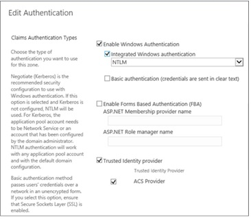
  
## Set the permissions

Use the following steps to set the permissions to access the web application.
  
1. In Central Administration, on the home page, click **Application Management**.
    
2. On the **Application Management** page, in the **Web Applications** section, click **Manage web applications**.
    
3. Click the appropriate web application, and then click **User Policy**.
    
4. In **Policy for Web Application**, click **Add Users**.
    
5. In the **Add Users** dialog box, click the appropriate zone in **Zones**, and then click **Next**.
    
6. In the **Add Users** dialog box, typeuser2@blueskyabove.onmicrosoft.com (ACS Provider).
    
7. In **Permissions**, click **Full Control**.
    
8. Click **Finish**, and then click **OK**.
    
The following figure illustrates the **Add Users** section of an existing web application.
  
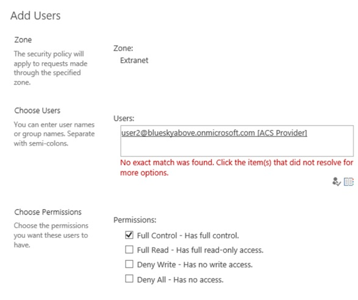
  
## Verify the new provider

Use the following steps to verify that the new identity provider is working by ensuring that the new authentication provider appears on the sign-in prompt.
  
1. Sign in by using the new provider named **Blue Sky Above**, as illustrated in the following figure.
    
     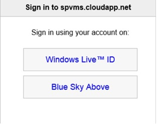
  
## Additional resources

[Understanding WS-Federation](https://go.microsoft.com/fwlink/p/?linkid=188052)
  
[Cloud adoption and hybrid solutions](cloud-adoption-and-hybrid-solutions.md)
  
## Join the discussion

|**Contact us**|**Description**|
|:-----|:-----|
|**What cloud adoption content do you need?** <br/> |We are creating content for cloud adoption that spans multiple Microsoft cloud platforms and services. Let us know what you think about our cloud adoption content, or ask for specific content by sending email to [cloudadopt@microsoft.com](mailto:cloudadopt@microsoft.com?Subject=[Cloud%20Adoption%20Content%20Feedback]:%20).  <br/> |
|**Join the cloud adoption discussion** <br/> |If you are passionate about cloud-based solutions, consider joining the Cloud Adoption Advisory Board (CAAB) to connect with a larger, vibrant community of Microsoft content developers, industry professionals, and customers from around the globe. To join, add yourself as a member of the [CAAB (Cloud Adoption Advisory Board) space](https://aka.ms/caab) of the Microsoft Tech Community and send us a quick email at [CAAB@microsoft.com](mailto:caab@microsoft.com?Subject=I%20just%20joined%20the%20Cloud%20Adoption%20Advisory%20Board!). Anyone can read community-related content on the [CAAB blog](https://blogs.technet.com/b/solutions_advisory_board/). However, CAAB members get invitations to private webinars that describe new cloud adoption resources and solutions.  <br/> |
|**Get the art you see here** <br/> |If you want an editable copy of the art you see in this article, we'll be glad to send it to you. Email your request, including the URL and title of the art, to [cloudadopt@microsoft.com](mailto:cloudadopt@microsoft.com?subject=[Art%20Request]:%20).  <br/> |
   

