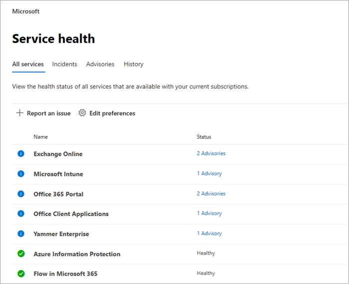
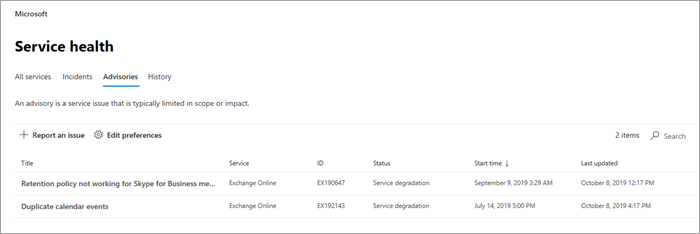

# How to check Office 365 service health

You can view the health of Office 365, Yammer, Microsoft Dynamics CRM, and Microsoft Intune cloud services on the Office 365 **Service health** page in the [admin center](https://go.microsoft.com/fwlink/p/?linkid=2024339). If you are experiencing problems with a cloud service, you can check the service health to determine whether this is a known issue with a resolution in progress before you call support or spend time troubleshooting. 

If you are unable to sign in to the service portal, you can use the [service status page](https://status.office365.com) to check for known issues preventing you from logging into your tenant.
  
### How to check service health

1. Go to [https://portal.office.com/adminportal/home](https://portal.office.com/adminportal/home#/homepage) and sign in with an admin account.

    > [!NOTE]
    > People who are assigned the global admin or service administrator role can view service health. To allow Exchange, SharePoint, and Skype for Business admins to view service health, they must also be assigned the Service admin role.
  
2. To view service health, in the admin center, go to **Health** > **Service health**, or select the **Service health** card on the **Home dashboard**. The dashboard card indicates whether there is an active service issue and links to the detailed **Service health** page.
  
3. On the **Service health** page, the health state of each cloud service is shown in a table format.

   

The **All services** tab (the default view) shows all services and their current health state. An icon and the **Status** column indicate the state of each service. To filter your view to services currently experiencing an incident, select the **Incidents** tab at the top of the page. Selecting the **Advisories** tab will show only services that currently have an advisory posted. The **History** tab shows the history of incidents and advisories that have been resolved.

If you're experiencing an issue that doesn't appear on the list, select **Report an issue**, complete the short form to tell us about the problem, and then select **Submit**.

> [!TIP]
> You can also use the [Office 365 Admin app](https://go.microsoft.com/fwlink/p/?linkid=627216) on your mobile device to view Service health, which is a great way to stay current with push notifications. 
  
### View details of posted service health

On the **All services** view, selecting the service status will open a summary view of advisories or incidents.
  

The advisory or incident summary provides the following information:

- **Title** - A summary of the problem.
- **Service** - The name of the affected service.
- **ID** - A numeric identifier for the problem.
- **Status** - How this problem affects the service.
- **Start time** - The time when the issue started.
- **Last updated** - The last time that the service health message was updated. We post frequent messages to let you know the progress that we're making in applying a solution.

Select the issue title to see the issue detail page, which shows more information about the issue, including the [history](#history) of all messages posted while we work on a solution.

### Translate service health details

Because service health explanations are posted in real-time, they are not automatically translated to your language and the details of a service event are in English only. To translate the explanation, follow these steps:
  
1. Go to [Translator](https://www.bing.com/translator/).

2. On the **Service health** page, select an incident or advisory. Under **Show details**, copy the text about the issue.

3. In Translator, paste the text and choose **Translate**.

### Definitions

Most of the time, services will appear as healthy with no further information. When a service is having a problem, the issue is identified as either an advisory or an incident and shows a current status.
  
> [!TIP]
> Planned maintenance events aren't shown in service health. You can track planned maintenance events by staying up to date with the **Message center**. Filter to messages categorized as Plan for change to find out when the change is going to happen, its effect, and how to prepare for it. See [Message center in Office 365](https://support.office.com/article/38fb3333-bfcc-4340-a37b-deda509c2093) for more details.
  
### Incidents and advisories

|||
|:-----|:-----|
||If a service has an advisory shown, we are aware of a problem that is affecting some users, but the service is still available. In an advisory, there is often a workaround to the problem and the problem may be intermittent or is limited in scope and user impact.    |
||If a service has an active incident shown, it's a critical issue and the service or a major function of the service is unavailable. For example, users may be unable to send and receive email or unable to sign-in. Incidents will have noticeable impact to users. When there is an incident in progress, we will provide updates regarding the investigation, mitigation efforts, and confirmation of resolution in the Service health dashboard.    |

### Status definitions

|**Status**|**Definition**|
|:-----|:-----|
|**Investigating** | We're aware of a potential issue and are gathering more information about what's going on and the scope of impact. |
|**Service degradation** | We've confirmed that there is an issue that may affect use of a service or feature. You might see this status if a service is performing more slowly than usual, there are intermittent interruptions, or if a feature isn't working, for example. |
|**Service interruption** | You'll see this status if we determine that an issue affects the ability for users to access the service. In this case, the issue is significant and can be reproduced consistently. |
|**Restoring service** | The cause of the issue has been identified, we know what corrective action to take, and are in the process of bringing the service back to a healthy state. |
|**Extended recovery** | This status indicates that corrective action is in progress to restore service to most users but will take some time to reach all the affected systems. You might also see this status if we've made a temporary fix to reduce impact while we wait to apply a permanent fix. |
|**Investigation suspended** | If our detailed investigation of a potential issue results in a request for additional information from customers to allow us to investigate further, you'll see this status. If we need you to act, we'll let you know what data or logs we need. |
|**Service restored** | We've confirmed that corrective action has resolved the underlying problem and the service has been restored to a healthy state. To find out what went wrong, view the issue details. |
|**Post-incident report published** | We’ve published a Post Incident Report for a specific issue that includes root cause information and next steps to ensure a similar issue doesn’t reoccur. |

### History

Service health lets you look at current health status and view the history of any service advisories and incidents that have affected your tenant in the past 30 days. To view the past health of all services, select **View history** on the issue detail page.
  

  
A list of all service health messages posted in the selected timeframe is displayed, as shown below:
  

  
Expand any row to view more details about the issue.
  
For more information about our commitment to uptime, see [Transparent operations from Office 365](https://go.microsoft.com/fwlink/?linkid=848695).
  
## Leave feedback

Our goal is to make sure that the information we provide to you about an ongoing issue is timely, accurate, and useful. To tell us how we're doing, select a star rating. After you give us a score from 1 to 5 stars, you can give feedback on any specific details. We'll use your feedback to fine-tune our service health system.
  
## See also

[Activity Reports in the Microsoft 365 admin center](https://support.office.com/article/0d6dfb17-8582-4172-a9a9-aed798150263)